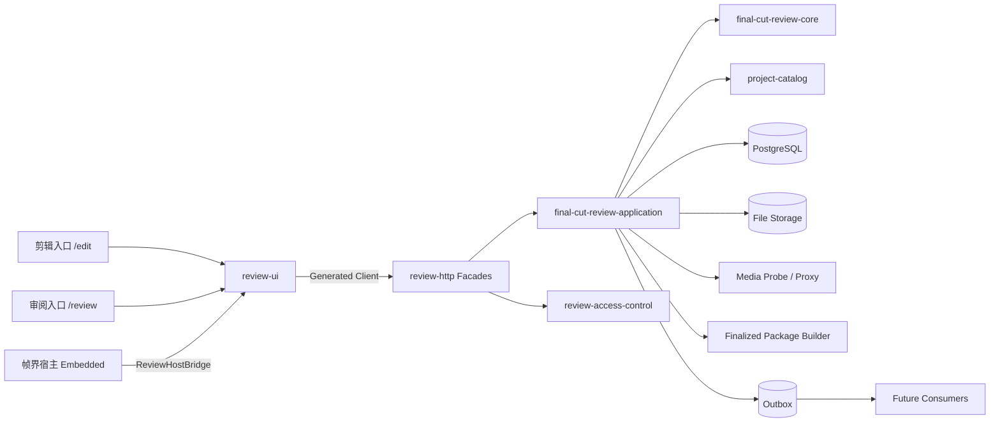
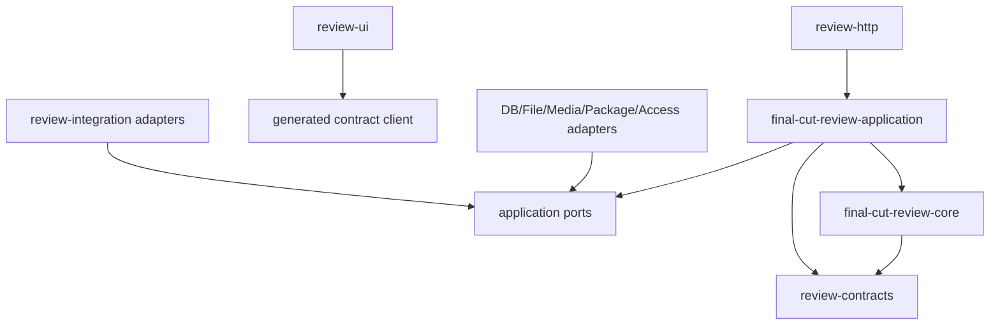
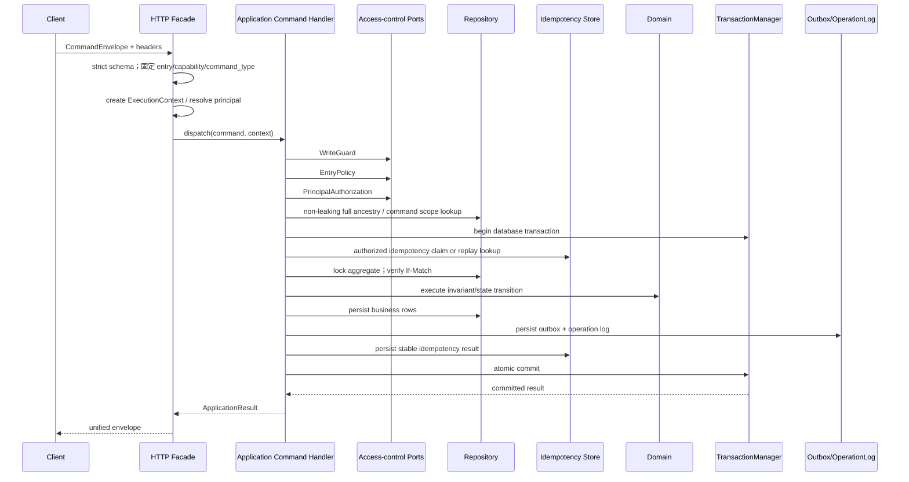
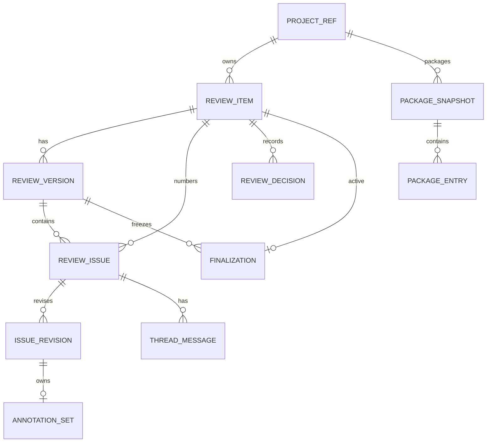
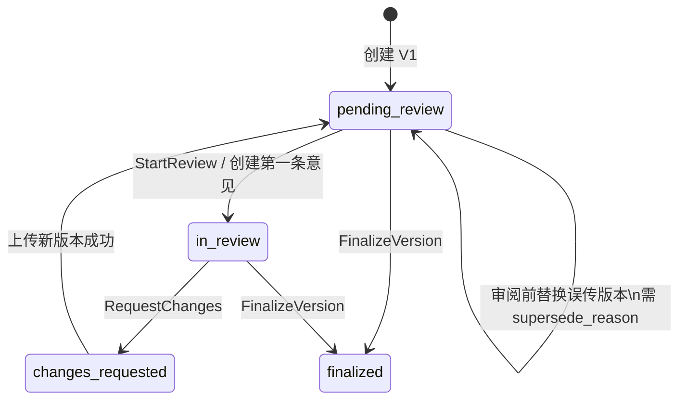
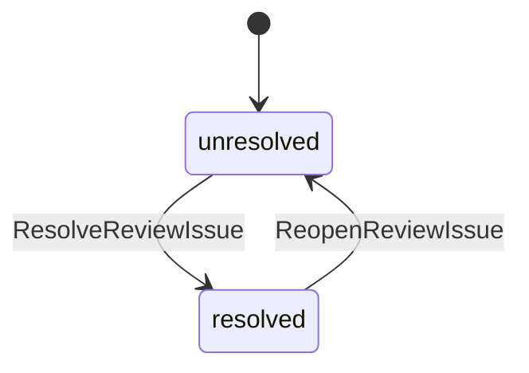
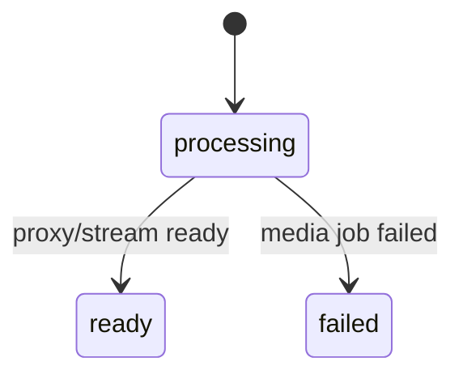
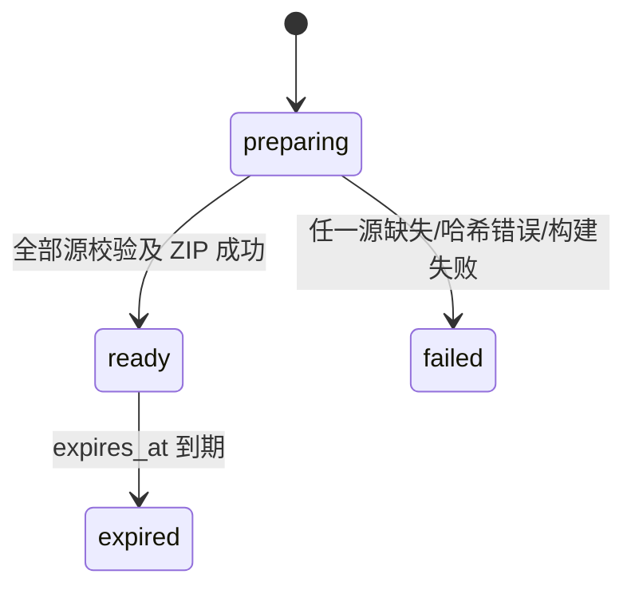
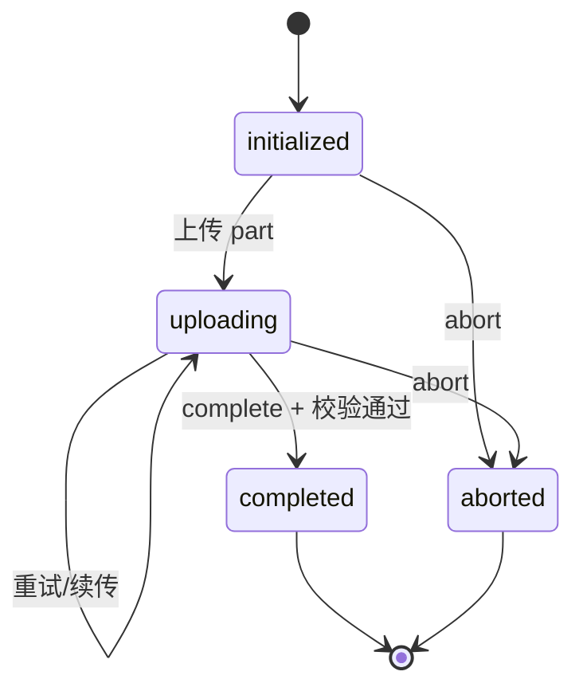
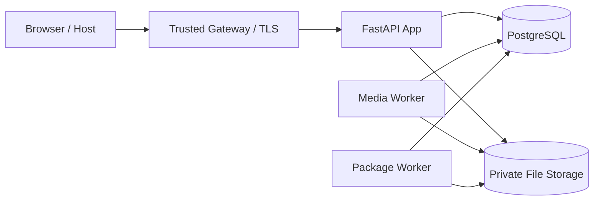

# 帧界成片审阅台技术设计文档（TDD）— 严格修订版

> 本文中的 **TDD** 指 Technical Design Document（技术设计文档），不是 Test-Driven Development。
>
> 本版针对《TDD / BDD 严格审查报告》的 P0/P1 缺陷进行结构性修复。当前输入中仍未包含权威全文 `FJ_Final_Cut_Review_SPEC_V1.3_Reviewed.md` 和正式 `contracts/final-cut-review/v1/` 契约树，因此本文是**确定性的候选技术基线**，不是最终发布批准证据。所有本文新增的确定性裁决必须回写正式契约源并通过生成、漂移和兼容检查后，方可转为 Approved。

| 属性 | 内容 |
| --- | --- |
| 文档编号 | `FJ-FCR-TDD-1.1-RC1` |
| 上一版本 | `FJ-FCR-TDD-1.0` |
| 产品目标基线 | `FJ_Final_Cut_Review_SPEC_V1.3_Reviewed.md` |
| 当前可核验输入 | `Product-Spec.md`、API/Architecture/Backend/Frontend/Threat/Design 文档 |
| 契约版本 | `1.0` |
| API 路径版本 | `/api/v1` |
| 模块清单版本 | `1` |
| 修订日期 | 2026-06-21 |
| 适用形态 | Standalone `/edit`、Standalone `/review`、Embedded |
| 文档状态 | `Provisional Technical Baseline`；Release Blocked，待权威 SPEC/Contract/CI/Design Evidence 闭环 |

---

## 1. 文档目的

本文把产品规格、API 契约、总体架构、后端设计、前端设计、安全模型和设计交付约束收敛为一份可实施、可验证、可审计的技术设计，主要用于：

1. 统一前后端、媒体、文件、打包和宿主集成的边界；
2. 明确领域模型、状态机、不变量、事务、幂等和并发控制；
3. 定义精确回放、批注坐标、版本隔离和定稿冻结的实现要求；
4. 形成 API、数据、事件、错误和安全控制的单一实施视图；
5. 为单元、契约、集成、组件、端到端和安全测试提供设计输入；
6. 为未来嵌入“帧界 AI 影视生产画布平台”提供稳定端口，而不改动核心领域规则。

## 2. 规范权威、证据边界与确定性裁决

### 2.1 规范优先级

发生冲突时按下列顺序裁决：

1. `FJ_Final_Cut_Review_SPEC_V1.3_Reviewed.md`；
2. `contracts/final-cut-review/v1/` 的 `openapi.yaml`、capabilities、errors、commands、queries、events、module manifest；
3. `API_CONTRACTS.md`、`ARCHITECTURE.md`、`BACKEND_DESIGN.md`、`FRONTEND_DESIGN.md`、`THREAT_MODEL.md`；
4. `ARCHITECTURE-MAP.md`、`Product-Spec.md`、`Design-Brief.md`；
5. 当前实现附录、历史 Prompt、参考图、既有 Figma 画面和旧 QA 证据。

低优先级材料不得扩大产品范围、改变状态机、削弱完整 ancestry、增加删除/撤销能力，或覆盖正式契约。

### 2.2 当前审查边界

本版能够作为实施候选设计，但不能单独证明：

- 对未提供的完整权威 SPEC 逐条无遗漏；
- 对未提供的正式 OpenAPI/JSON Schema/Event Schema 逐字段一致；
- 代码、迁移、CI、E2E 和设计证据已经执行并通过。

因此，本文使用 `MUST` 表示候选基线中的强制要求；若正式权威源与本文不同，必须先完成差异评审，不得在实现层静默选择任一版本。

### 2.3 本次修订冻结的设计裁决

以下裁决消除旧版中的“或、建议、按契约决定”等不确定表述。它们必须同步进入正式契约源：

| 决策 ID | 冻结行为 |
| --- | --- |
| DCD-001 | Unified Envelope 唯一采用 `{data, meta}`、列表 `{data:[], meta}`、错误 `{error:{...}}`；禁止顶层 `request_id/contract_version` 的第二形态。 |
| DCD-002 | 客户端提交任何可信安全字段均以 strict schema 拒绝，返回 `VALIDATION_ERROR`/422；不采用“忽略后继续”。 |
| DCD-003 | route 与 `command_type` 不匹配、`Idempotency-Key != command_id`、`If-Match` 格式非法或与 envelope 版本不一致，均返回 `VALIDATION_ERROR`/422。 |
| DCD-004 | 不支持的 `Content-Type` 在 V1 统一映射为 `VALIDATION_ERROR`/422；正式契约若新增 415 专用错误码，必须作为 additive contract change。 |
| DCD-005 | 缺少写保护凭据返回 `WRITE_GUARD_REQUIRED`/403；凭据存在但过期、篡改或校验失败返回 `WRITE_GUARD_INVALID`/403。 |
| DCD-006 | 项目编码冲突返回 `VALIDATION_ERROR`/422，`details.field=project_code`、`details.reason=not_unique`。 |
| DCD-007 | 归档项目的项目/审阅聚合写入返回 `RESOURCE_STATE_CONFLICT`/409；读取、既有定稿下载和 review 项目包仍允许。 |
| DCD-008 | 已完成或已绑定上传会话执行 abort 返回 `RESOURCE_STATE_CONFLICT`/409，且不得删除业务文件。 |
| DCD-009 | 媒体探测不完整、原片不可解析或 media snapshot 缺失返回 `VERSION_FILE_NOT_READY`/409；播放代理 processing/failed 返回 `PLAYBACK_NOT_READY`/409。 |
| DCD-010 | `item_code`、服务端分配的 `issue_no/version_no` 被客户端提交或修改时返回 `VALIDATION_ERROR`/422。 |
| DCD-011 | `pending_review` 误传替换未提供 `supersede_reason` 返回 `VALIDATION_ERROR`/422。 |
| DCD-012 | 对 historical version 的任何审阅写入返回 `VERSION_NOT_CURRENT`/409。 |
| DCD-013 | 重复 Resolve、重复 Reopen、重复 StartReview 使用新 command_id 时返回 `RESOURCE_STATE_CONFLICT`/409；相同必需幂等键的重放仍返回首次结果。 |
| DCD-014 | 已有 active finalization 或 item 已 finalized 时，新 FinalizeVersion 返回 `REVIEW_ITEM_FINALIZED`/409。 |
| DCD-015 | 未定稿条目请求 finalized-original 返回 `RESOURCE_STATE_CONFLICT`/409；跨 ancestry 则始终返回 `RESOURCE_NOT_FOUND`/404。 |
| DCD-016 | 包源缺失返回 `PACKAGE_SOURCE_MISSING`/409；源存在但 SHA-256 不匹配返回 `FILE_HASH_MISMATCH`/409。 |
| DCD-017 | 成功签发单片下载描述时必须写 `review.finalized_original.download_requested` 事件和 Operation Log，不再是可选行为。 |
| DCD-018 | `UpdateReviewItem` 在当前 V1 只写 Operation Log，不发领域事件；`review.item.updated` 当前不在事件注册表。若产品需要该事件，必须先以 additive contract change 将其加入正式契约。 |
| DCD-019 | PlaybackStatus 的公开状态只有 `processing|ready|failed`；`failed -> processing` 仅可由媒体子系统内部重试任务驱动，不新增外部领域命令或用户能力。 |
| DCD-020 | 1280–1365px 固定为播放器 + 340px 意见栏，150px 版本栏折叠；≥1366 三栏同显；<1280 意见栏为抽屉且版本栏折叠。 |
| DCD-021 | 直接修改旧 Revision 的 HTTP mutation route 不存在，发送 PATCH/POST 到 revision collection mutation 路径返回 405。 |
| DCD-022 | 回复中的附件、mention、notification 字段及 filename 路径/控制字符均 strict reject，返回 `VALIDATION_ERROR`/422。 |
| DCD-023 | Manifest 必须包含完整 generated capability registry，并与 `capabilities.yaml` 逐项一致。 |
| DCD-024 | 当前 Gherkin 仅在存在 runner、step definitions、fixture、undefined-step gate 和实际报告时才可称为“可执行”；本文不把文本解析成功等同于测试通过。 |
| DCD-025 | 为保证 405/416 也使用统一错误包络，正式错误注册表必须以 additive V1 change 增加 `METHOD_NOT_ALLOWED`/405 与 `RANGE_NOT_SATISFIABLE`/416。 |

### 2.4 尚未关闭的外部阻断项

| ID | 阻断项 | 关闭证据 |
| --- | --- | --- |
| EXT-001 | 权威 SPEC 全文未作为本次修订输入 | Requirement ID 级 diff 为零或存在正式 waiver |
| EXT-002 | 正式 contract tree 未提供核验 | 生成器、drift、breaking/event compatibility、hash 全部通过 |
| EXT-003 | 代码和 CI 运行证据未包含在本修订包 | 同一 commit SHA 的测试报告、迁移测试、E2E trace |
| EXT-004 | Chapter 40 Figma 视觉证据仍为 Partial | Evidence Manifest、节点、截图 hash、review 结论完整 |

## 3. 产品目标、范围与非目标

### 3.1 核心业务流程

```text
项目管理
→ 创建成片条目并上传 V1
→ 在线播放与逐帧审阅
→ 时间码意见与画面批注
→ 点击意见/时间码/时间轴点精确回放到所属版本和帧
→ 要求修改
→ 在同一成片条目下追加新版本
→ 独立审阅当前版本
→ 定稿
→ 下载单个定稿原片
→ 打包下载当前项目全部有效定稿原片
```

### 3.2 技术目标

- 以单一契约源生成 DTO、客户端、服务端 Schema、能力、事件和测试夹具；
- `/edit` 与 `/review` 共享页面、组件、读模型、命令处理器和领域模型；
- 使用薄 Facade 固定入口来源、命令类型和能力，不在 Facade 复制业务逻辑；
- 全链路使用完整父子上下文，防止串项目、条目、版本、意见、回复、标记、定稿和包；
- 使用显式状态机、乐观锁、幂等记录和事务 Outbox 保证一致性；
- 使用真实 `HTMLVideoElement` 事件实现同版本 review timeline 帧级精确回放；
- 使用实际视频矩形归一化批注坐标，兼容黑边、全屏和 DPR；
- 定稿及包冻结文件身份和 SHA-256，防止后续漂移；
- 通过端口/适配器支持当前独立部署和未来宿主替换。

### 3.3 明确非目标

V1 不实现：

- 登录、账号、成员、角色或项目成员管理 UI；
- 通知中心、任务中心、交付中心、下载中心；
- 手机布局；
- AI 功能；
- 业务删除、覆盖历史版本、撤销或替换定稿；
- 跨版本意见继承、自动匹配、自动时间码映射、自动修复判断；
- 永久公开下载 URL；
- SMPTE Drop Frame；
- VFR 源文件编码包 PTS 级等价保证。

---

## 4. 关键质量属性

| 质量属性 | 目标与约束 |
| --- | --- |
| 一致性 | 业务数据与 Outbox 同事务；多实体状态转换原子提交；乐观锁拒绝丢失更新。 |
| 隔离性 | 命令、查询、缓存 key、播放目标均携带完整 ancestry；父子不匹配统一为 404。 |
| 安全性 | `ExecutionContext` 由服务端创建；客户端安全字段不可信；共享码不落库、不入日志；文件仅以 File ID 暴露。 |
| 可追溯性 | request/correlation/causation ID、操作日志、领域事件和聚合版本可关联。 |
| 可替换性 | 项目目录、授权、写保护、文件、媒体、打包、宿主均为端口；替换适配器不改领域契约。 |
| 可测试性 | 领域层无框架、数据库、网络、文件系统和系统时钟依赖；Clock/ID/Transaction 可注入。 |
| 性能 | 大文件分片与续传；Range 流式读取；列表分页；包异步构建；不把大文件整体读入内存。 |
| 可靠性 | 上传、媒体探测、精确回放和包生成均有显式状态、错误和重试路径。 |
| 兼容性 | Contract V1 仅允许向后兼容扩展；未知安全枚举值需安全降级。 |
| 可访问性 | 键盘操作、ARIA、Tooltip、可见焦点、非仅颜色状态、至少 28×28 点击区。 |

---

## 5. 系统上下文



### 5.1 参与者与入口能力概览

| 参与者/入口 | 核心职责 |
| --- | --- |
| `/edit` | 项目创建/编辑/归档/恢复、条目创建/编辑、V1 与新版本上传、人工版本对比、意见只读、定稿信息只读、单片定稿原片下载。 |
| `/review` | 启动审阅、创建/更新/回复/解决/重开意见、要求修改、定稿、单片下载、项目定稿包。 |
| `embedded` | 宿主注入项目目录、主体、授权、HTTP、事件、文件、Portal 与主题；未注入能力时只读。 |
| 匿名主体 | 无账号维度，但仍执行入口、写保护、ancestry 和状态机；不是授权绕过。 |
| 服务主体 | 未来用于媒体、包和事件任务；不得直接改数据库绕过命令。 |

---

## 6. 总体架构

### 6.1 逻辑模块

| 模块 | 职责 | 明确禁止 |
| --- | --- | --- |
| `review-contracts` | OpenAPI、命令/查询 DTO、能力、错误、事件、模块清单、代码生成 | 业务逻辑、数据库访问 |
| `project-catalog` | 本地项目 CRUD/归档/恢复及未来宿主目录适配 | 拥有条目、版本、意见和定稿规则 |
| `final-cut-review-core` | 聚合、实体、值对象、状态机、不变量和领域错误 | HTTP、UI、ORM、文件、授权、宿主依赖 |
| `final-cut-review-application` | 命令处理、查询服务、事务、幂等、乐观锁和端口协调 | 依赖具体 S3/MinIO/本地物理路径 |
| `review-access-control` | EntryPolicy、WriteGuard、PrincipalAuthorization 端口与适配器 | 修改领域对象 |
| `review-media` | 上传会话、文件校验、媒体探测、代理、流、播放状态 | 决定审阅状态转换 |
| `finalized-package` | 冻结包快照、ZIP 构建、状态、过期和短期下载令牌 | 决定版本能否定稿 |
| `review-integration` | Outbox、事件发布、操作日志、宿主桥接和未来集成 | 消费者直接修改聚合 |
| `review-http` | 路由、上下文、头部校验、DTO 映射、命令/查询分发 | 复制业务服务和状态机 |
| `review-ui` | 共享页面、CapabilityGate、播放器、批注、精确回放、嵌入和样式隔离 | 数据库/仓库访问、可信身份计算 |

### 6.2 依赖方向

依赖方向以“调用方依赖被调用方公开抽象”为准：



物理代码依赖必须满足：

```text
http -> application
application -> domain + application ports + generated contracts
adapters -> application ports
ui -> generated contracts/client
integration consumer -> public commands
```

禁止反向依赖：

- `domain -> FastAPI | SQLAlchemy | React | HTTP | Nginx | WriteGuard | HostBridge | localStorage`；
- `application -> concrete S3/MinIO/local path | FastAPI route | React`；
- `HTTP Facade -> repository | transaction manager | domain aggregate mutation`；
- `domain -> TransactionManager`；
- `ui -> repository | database | trusted identity`；
- `integration consumer -> direct aggregate mutation`；
- `review-media -> review state machine`；
- `finalized-package -> finalization eligibility`。

Import guard 必须在 CI 中验证上述方向。

### 6.3 当前实现栈与规范边界

| 层 | 当前实现目标 | 规范约束 |
| --- | --- | --- |
| 前端 | React、TypeScript、React Query、Playwright、真实 HTMLVideoElement | 框架可替换，但精确回放、能力和契约语义不可变 |
| 后端 | Python、FastAPI、Pydantic、SQLAlchemy、Alembic | HTTP 为薄 Facade；领域保持纯净 |
| 数据库 | PostgreSQL；SQLite 仅测试 | 生产需 FK、事务、部分唯一索引和约束 |
| 文件 | `FileStoragePort` | File ID 间接访问；无物理路径出边界 |
| 媒体 | `MediaPort` | 有理数 FPS、媒体快照、playback readiness |
| 包 | `FinalizedPackagePort` | 只按冻结快照构建，不重新选择业务文件 |

---

## 7. 契约优先设计

### 7.1 唯一契约源

```text
contracts/final-cut-review/v1/
├── openapi.yaml
├── capabilities.yaml
├── errors.yaml
├── commands/
├── queries/
├── events/
└── module-manifest.json
```

生成产物至少包括：

- TypeScript DTO 和 API Client；
- 后端请求/响应 Schema；
- 能力常量；
- 事件载荷 Schema；
- 契约测试夹具；
- 前后端生成物哈希或漂移校验结果。

外部 JSON 统一 `snake_case`。TypeScript `camelCase` 只能是同一 Schema 的生成投影，禁止手写第二套同名语义 DTO。

### 7.2 版本策略

- HTTP Path：`/api/v1`；
- Contract：`1.0`；
- Manifest：`1`；
- 每类 Event 初始版本：`1`；
- V1 可新增可选字段、端点、能力、事件和 unknown-safe 枚举；
- 删除字段、可选改必填、已有语义改变、错误/事件字段含义改变均要求 Contract V2。

### 7.3 统一响应包络

成功：

```json
{
  "data": {},
  "meta": {
    "request_id": "uuid",
    "contract_version": "1.0"
  }
}
```

列表：

```json
{
  "data": [],
  "meta": {
    "total_count": 100,
    "page": 1,
    "page_size": 20,
    "request_id": "uuid",
    "contract_version": "1.0"
  }
}
```

错误：

```json
{
  "error": {
    "code": "RESOURCE_STATE_CONFLICT",
    "message": "当前状态不允许执行此操作",
    "http_status": 409,
    "details": {},
    "request_id": "uuid",
    "timestamp": "2026-06-19T00:00:00Z",
    "contract_version": "1.0"
  }
}
```

实施要求：

- 所有响应由共享序列化器/中间件生成；
- `request_id` 与请求头、操作日志、事件元数据一致；
- `details` 不泄露父子关系、物理路径、存储令牌或写保护信息；
- 契约测试固定 success/list/error 三种形态；
- 客户端不得长期兼容两套互斥包络。

### 7.4 CommandEnvelope

```text
command_id
command_type
contract_version = 1.0
expected_aggregate_version?
payload
```

规则：

1. 每个写路由固定映射一个 `command_type`；客户端类型不匹配时拒绝；
2. `Idempotency-Key` 存在时必须等于 `command_id`，或由受信网关显式映射；
3. 客户端只提交业务、并发和幂等数据；
4. `ExecutionContext` 与 payload 分离，由服务端创建；
5. `If-Match` 映射为 `lock_version`；若 envelope 同时有 expected version，两者必须一致。

### 7.5 Query 契约

查询返回 Read DTO，不返回 ORM 对象或聚合根。对象查询至少携带：

```text
project_ref_id
review_item_id（适用时）
version_id（适用时）
issue_id（适用时）
```

禁止：

```text
getVersion(versionId)
getIssue(issueId)
getAnnotation(annotationId)
```

统计必须区分：

- 当前版本 unresolved/resolved；
- 历史版本 unresolved/resolved；
- 定稿只使用当前版本 unresolved 计数。

### 7.6 请求头与前置条件

| Header | 作用 | V1 确定规则 |
| --- | --- | --- |
| `X-Request-ID` | 追踪 | 合法 UUID/受限字符串则复用；缺失或非法时服务端生成新值并在响应返回。 |
| `Idempotency-Key` | 必需幂等操作 | 必须与 `command_id` 完全相同；缺失或不一致返回 `VALIDATION_ERROR`/422。 |
| `If-Match` | 乐观锁 | 格式为强 ETag 十进制版本：`"7"`；弱 ETag、通配符、非整数或缺失均返回 `VALIDATION_ERROR`/422。 |
| `Content-Type` | JSON/上传协议 | 不在该路由允许集合内统一返回 `VALIDATION_ERROR`/422。 |
| `Origin`/`Referer` | Cookie 写保护 CSRF 校验 | shared_code 模式下写请求必须满足同源/配置 allowlist；不满足返回 `WRITE_GUARD_INVALID`/403。 |
| 可信代理 Header | reverse_proxy 写保护 | 仅来自 `TRUSTED_PROXY_CIDRS` 且经边界代理清洗后可信。 |

任何 Header 不得直接声明 capability、role、principal、permission 或 `write_guard_verified`。

### 7.7 成功状态码

| 操作类型 | HTTP |
| --- | ---: |
| 对象/列表读取、更新、状态转换、upload complete/abort | 200 |
| CreateProject、CreateReviewItem、UploadReviewVersion、CreateReviewIssue、AddReviewMessage、FinalizeVersion | 201 |
| PrepareFinalizedPackage | 202 |
| 单片/包完整下载 | 200 |
| 单 Range 下载 | 206 |
| 无效/不可满足/多 Range | 416 |
| 未注册 DELETE 或 mutation route | 405 |

## 8. 能力与访问控制

### 8.1 ExecutionContext 与不可信输入

服务端生成：

```text
requestId
correlationId
causationId?
entrySource: edit | review | embedded | unspecified
principal.kind: anonymous | account | service
principal.id?
writeGuard.mode: none | shared_code | reverse_proxy
writeGuard.verified
client.ip?
client.userAgent?
host.hostProjectId?
host.hostModuleId?
```

客户端请求体及普通 Header 禁止出现：

```text
capabilities
permissions
roles
is_admin
is_reviewer
security_context
write_guard_verified
principal_id
```

所有命令和查询 Schema 使用 `additionalProperties: false`。出现上述字段时请求在进入授权和业务层前返回：

```text
HTTP 422
error.code = VALIDATION_ERROR
details.reason = trusted_field_forbidden
details.fields = [实际字段名]
```

不得采用“忽略字段并继续”的兼容分支。

### 8.2 命令授权、幂等与事务顺序



强制规则：

1. HTTP Facade 只能做 transport、strict schema、固定映射、ExecutionContext 创建和 dispatch；不得直接调用 Repository、Domain 或 Transaction。
2. Domain 返回状态变化和领域事件，不依赖 TransactionManager。
3. 写保护、入口和主体授权必须在读取或返回历史幂等结果之前完成。
4. 对需要资源范围才能授权的命令，先以完整 ancestry 执行非泄漏 lookup；父子不匹配返回 404，且不得查询其他 scope 的幂等结果。
5. idempotency claim、业务写、Outbox、成功 Operation Log 和稳定响应快照必须处于同一数据库事务；回放分支完成授权和 scope 校验后才能读取已提交结果。
6. 最终授权是 WriteGuard、EntryPolicy、PrincipalAuthorization、ancestry 和 state 的交集。
7. 拒绝路径的 Operation Log 使用独立最小事务写入，但不得包含 secret、cookie、token、物理路径或资源真实父级。

### 8.3 入口能力矩阵

| 能力 | `/edit` | `/review` |
| --- | :---: | :---: |
| `review.project.read` | ✓ | ✓ |
| `review.project.create/update/archive/restore` | ✓ | — |
| `review.item.read` | ✓ | ✓ |
| `review.item.create/update` | ✓ | — |
| `review.version.read/compare` | ✓ | ✓ |
| `review.version.upload` | ✓ | — |
| `review.issue.read` | ✓ | ✓ |
| `review.issue.create/update/reply/resolve/reopen` | — | ✓ |
| `review.session.start/request_changes` | — | ✓ |
| `review.finalization.read` | ✓ | ✓ |
| `review.finalization.create` | — | ✓ |
| `review.download.finalized_original` | ✓ | ✓ |
| `review.package.create/read/download` | — | ✓ |
| 任意 delete | — | — |

### 8.4 WriteGuard 模式

| 模式 | 设计要求 |
| --- | --- |
| `none` | 仅用于受控内网；仍执行入口、主体、ancestry 和状态机。 |
| `shared_code` | 共享码只发验证端点；成功签发短期 HttpOnly、SameSite Cookie；码值或哈希不得进入浏览器存储、数据库、日志、错误或响应；失败限流。 |
| `reverse_proxy` | 只信任配置的可信代理标记；应用入口清洗外部同名头，防止直连伪造。 |

### 8.5 当前与未来适配器

当前：`StaticEntryPolicyAdapter`、`NoAccountAuthorizationAdapter`、`NoWriteGuardAdapter`、`SharedCodeWriteGuardAdapter`、`ReverseProxyWriteGuardAdapter`。

未来账号或画布接入只替换 Principal Resolver、Authorization、Project Catalog、HTTP/File/Event/Host Bridge 适配器，不修改领域命令、状态机、业务 DTO、播放器、批注和事件结构。

---

## 9. 领域模型

### 9.1 聚合与实体

| 对象 | 关键字段 | 责任 |
| --- | --- | --- |
| `ProjectRef` | id、source、local/external ID | 审阅核心与本地/宿主项目解耦 |
| `FinalCutReviewItem` | project、item_code、title、workflow_status、current_version_id、active_finalization_id、lock_version | 审阅工作流聚合根 |
| `ReviewVersion` | version_no、previous_version_id、is_current、original media snapshot、playback asset/status、notes、lock_version | 版本与媒体身份 |
| `OriginalMediaSnapshot` | file_id、filename、MIME、size、SHA-256、duration、width、height、fps_num/den、probe_version | 不可变原片快照 |
| `ReviewIssue` | issue_no、project/item/version、status、current_revision_id、timestamp_ms、frame_number、lock_version | 版本内意见状态 |
| `ReviewIssueRevision` | revision_no、content、annotation_set_id | 意见/标记的不可变修订 |
| `ReviewAnnotationSet` | issue/revision/version、frame、canvas/video size、normalized shapes | 不可变画面批注 |
| `ReviewThreadMessage` | issue/version、content、created_at | 文本回复；V1 不存个人显示名 |
| `ReviewDecision` | type=`changes_requested`、note | 要求修改结论 |
| `FinalizationRecord` | version、original media snapshot、finalized_at、status | 冻结定稿 |
| `FinalCutPackageSnapshot` | project、entries、status、expires_at | 项目包冻结文件清单 |

### 9.2 关系图



### 9.3 身份与编号

- `review_item_id`、`version_id`、`issue_id`、`revision_id` 是稳定不可推断 ID；
- `item_code` 在项目内唯一，创建后不可修改；
- `version_no` 在条目内唯一，按 `max(version_no)+1` 分配；
- `issue_no` 在条目内唯一，不按版本重置；
- `revision_no` 在 issue 内递增；
- 显示版本号、文件名、时间码文本、数组下标均不是业务身份。

### 9.4 全局不变量

| ID | 不变量 |
| --- | --- |
| INV-001 | 每个条目仅一个 current version。 |
| INV-002 | 历史版本原片快照不可修改。 |
| INV-003 | 上传完成、哈希校验和媒体探测成功后才切 current version。 |
| INV-004 | issue、revision、annotation、message 绑定确切 project/item/version ancestry。 |
| INV-005 | 新版本不继承、不复制、不映射历史意见或批注。 |
| INV-006 | finalized 条目拒绝全部业务写命令。 |
| INV-007 | 定稿只检查 current version；历史 unresolved 不阻止。 |
| INV-008 | 每个条目最多一个 active finalization。 |
| INV-009 | 定稿下载只返回 active finalization 冻结的 original。 |
| INV-010 | 项目包只读取创建时冻结的 active finalization 快照。 |
| INV-011 | 文件访问按 File ID，不按物理路径。 |
| INV-012 | 数据库、仓库和应用服务均验证 ancestry。 |
| INV-013 | resolved issue 必须 reopen 后才能编辑。 |
| INV-014 | 播放、seek、切版本和 GET 不改变 workflow status。 |
| INV-015 | 不存在业务 DELETE、历史覆盖或撤销定稿命令。 |

---

## 10. 状态机

### 10.1 Review Item 工作流



| 当前状态 | 命令 | 前置条件 | 结果 |
| --- | --- | --- | --- |
| `pending_review` | `StartReview` | current version；playback ready | `in_review` |
| `pending_review` | `CreateReviewIssue` | current version；playback ready | 同事务转 `in_review` 并创建 issue |
| `in_review` | `RequestChanges` | current；至少 1 unresolved；note 非空；playback ready | `changes_requested` |
| `changes_requested` | `UploadReviewVersion` | 上传、哈希和媒体探测完成 | 新版本 current；`pending_review` |
| `pending_review` | `UploadReviewVersion` | 审阅前/误传替换；`supersede_reason` 必填 | 新版本 current；仍 `pending_review` |
| `in_review` | `UploadReviewVersion` | 无 | 拒绝 `REVIEW_IN_PROGRESS` |
| `pending_review`/`in_review` | `FinalizeVersion` | current；当前 unresolved=0；ready；原片与哈希有效；无 active finalization | `finalized` |
| `finalized` | 任意写命令 | 无 | 拒绝 `REVIEW_ITEM_FINALIZED` |

### 10.2 Issue 状态机



- 仅 `/review` 可 resolve/reopen；
- 状态只影响 issue 所属版本；
- resolved issue 不能直接编辑；
- 更新文字或标记创建新 immutable revision，不覆盖旧 revision。

### 10.3 PlaybackStatus



公开领域/API 状态仅为 `processing | ready | failed`：

- `processing` 或 `failed` 对 StartReview、CreateReviewIssue、RequestChanges、FinalizeVersion 返回 `PLAYBACK_NOT_READY`/409；
- 媒体子系统可通过内部、幂等的 worker retry 将失败任务重新排队，但该动作不是 Review Command、不是用户能力、没有新 HTTP 领域路由；
- UI 精确回放的“重试”只重新执行加载/查询/seek 流程；若版本仍 failed，继续显示 `PLAYBACK_NOT_READY`，不得伪造 ready。

### 10.4 PackageStatus



- `preparing` 下载返回 `PACKAGE_NOT_READY`；
- 源缺失返回/记录 `PACKAGE_SOURCE_MISSING`；源存在但哈希不一致返回/记录 `FILE_HASH_MISMATCH`；
- 到期下载返回 `PACKAGE_EXPIRED`；
- 不提供永久包历史或下载中心。

---

## 11. 应用服务、命令与事务

### 11.1 领域命令目录

| Command | 入口 | Capability | Idempotency-Key | If-Match | 成功 HTTP | 必发事件 |
| --- | --- | --- | :---: | :---: | ---: | --- |
| `CreateProject` | edit | `review.project.create` | 必需 | — | 201 | `review.project.created` |
| `UpdateProject` | edit | `review.project.update` | 不使用 | 必需 | 200 | `review.project.updated` |
| `ArchiveProject` | edit | `review.project.archive` | 不使用 | 必需 | 200 | `review.project.archived` |
| `RestoreProject` | edit | `review.project.restore` | 不使用 | 必需 | 200 | `review.project.restored` |
| `CreateReviewItem` | edit | `review.item.create` | 必需 | — | 201 | `review.item.created` |
| `UpdateReviewItem` | edit | `review.item.update` | 不使用 | 必需 | 200 | 无领域事件；写 Operation Log |
| `UploadReviewVersion` | edit | `review.version.upload` | 必需 | 必需 | 201 | `review.version.uploaded` |
| `StartReview` | review | `review.session.start` | 不使用 | 必需 | 200 | `review.session.started` |
| `CreateReviewIssue` | review | `review.issue.create` | 必需 | 必需 | 201 | `review.issue.created`；首条时先发 `review.session.started` |
| `UpdateReviewIssue` | review | `review.issue.update` | 不使用 | 必需 | 200 | `review.issue.updated` |
| `AddReviewMessage` | review | `review.issue.reply` | 不使用 | 必需 | 201 | `review.issue.message_added` |
| `ResolveReviewIssue` | review | `review.issue.resolve` | 不使用 | 必需 | 200 | `review.issue.resolved` |
| `ReopenReviewIssue` | review | `review.issue.reopen` | 不使用 | 必需 | 200 | `review.issue.reopened` |
| `RequestChanges` | review | `review.session.request_changes` | 必需 | 必需 | 200 | `review.changes_requested` |
| `FinalizeVersion` | review | `review.finalization.create` | 必需 | 必需 | 201 | `review.version.finalized` |
| `PrepareFinalizedPackage` | review | `review.package.create` | 必需 | — | 202 | `review.package.requested` |

`CompleteUpload` 不是领域命令。它是文件 API 操作，使用独立 UploadCompleteRequest Schema，并强制 `Idempotency-Key`。

### 11.2 通用命令处理模板

```text
1. HTTP strict schema、contract_version、route-command 和 Header 校验
2. 服务端建立 ExecutionContext 并解析 principal
3. Application 执行 WriteGuard
4. Application 执行 EntryPolicy
5. Application 执行 PrincipalAuthorization
6. 使用完整 ancestry 建立 resource/command scope
7. 仅在授权后查询或预留 idempotency record
8. 以固定锁顺序加载聚合并校验 If-Match/expectedAggregateVersion
9. Domain 校验状态机与不变量并返回 DomainResult + events
10. 单事务写业务数据、idempotency result、Outbox、Operation Log
11. 提交后由 HTTP Facade 序列化统一包络
```

禁止：HTTP 层直接仓储编排；Domain 调事务；先回放幂等结果后授权；仅凭前端 CapabilityGate；在事务外写 Outbox。

### 11.3 关键事务流程

#### 11.3.1 CreateReviewItem

单事务：验证 active 项目和目录 feature；校验项目内 `item_code` 唯一；验证 upload complete、hash、类型和媒体快照；创建 Item、V1、current pointer；初始化 `pending_review`；写 `review.item.created` 和幂等结果。任一步失败全部回滚。

#### 11.3.2 UploadReviewVersion

锁定 ReviewItem 后从 `next_version_no` 分配版本号；`in_review` 返回 `REVIEW_IN_PROGRESS`；`pending_review` 必须有 `supersede_reason`；验证文件与 probe；原子切换旧/new `is_current` 和 `current_version_id`；`changes_requested -> pending_review`；历史 issue/revision/annotation/message 不复制；写事件和幂等结果。

#### 11.3.3 StartReview

仅 `pending_review`、current version、playback ready。重复 StartReview 使用新 command_id 返回 `RESOURCE_STATE_CONFLICT`。播放、seek、GET 和版本切换不得触发该转换。

#### 11.3.4 CreateReviewIssue

锁定 item/current version；校验 target、playback ready、timestamp/frame consistency；从 `next_issue_no` 原子分配编号；若 item 为 pending，则同事务先转 in_review；创建 issue、Revision 1 和可选 AnnotationSet；Outbox 中 `review.session.started` 的插入顺序早于 `review.issue.created`。

#### 11.3.5 UpdateReviewIssue

V1 采用**完整替换 Revision**：

```text
payload.content       必填，完整新文本
payload.annotation    必填；对象表示完整新快照，null 表示清空批注
timestamp_ms/frame_number 不允许修改
```

- issue 必须属于 current version、处于 unresolved，item 非 finalized/changes_requested；
- 每次更新创建 `revision_no + 1`；
- `annotation` 为对象时创建新的 AnnotationSet，即使形状与上一版相同也不复用旧 ID；
- `annotation=null` 时新 Revision 无 AnnotationSet；
- 原子切换 `current_revision_id`，旧 Revision/AnnotationSet 永久只读；
- 直接修改历史 Revision 的路由不存在，HTTP mutation 返回 405。

#### 11.3.6 AddReviewMessage

消息文本非空、纯文本、完整 ancestry、current version、可写状态。Payload 只允许 `content`；attachment、mention、notification 和个人显示名字段返回 `VALIDATION_ERROR`。写 `review.issue.message_added`。

#### 11.3.7 Resolve / Reopen

均只允许 current version：`unresolved -> resolved`、`resolved -> unresolved`。新 command_id 对已处于目标状态的请求返回 `RESOURCE_STATE_CONFLICT`；历史版本返回 `VERSION_NOT_CURRENT`。

#### 11.3.8 RequestChanges

锁 item/current version；要求 `in_review`、playback ready、note 非空、current unresolved ≥1；创建 Decision、状态改 changes_requested、写事件/幂等/锁版本。之后 issue/message/finalize 写入返回 `RESOURCE_STATE_CONFLICT`，直至新版本上传。

#### 11.3.9 FinalizeVersion

获取 project_ref、item、current version 锁；要求 `confirmed=true`、pending/in_review、current unresolved=0、playback ready、original 存在且 hash 匹配、media snapshot 完整、无 active finalization；创建 immutable FinalizationRecord，设置 active pointer 和 finalized；写事件和幂等结果。相同 idempotency key 重放首次结果，新 key 返回 `REVIEW_ITEM_FINALIZED`。

#### 11.3.10 PrepareFinalizedPackage

锁 project_ref 后读取该项目 active finalizations；空集合返回 `PACKAGE_NO_FINALIZED_FILES`；事务内冻结 entries 并创建 preparing snapshot；返回 202；异步 builder 只读 snapshot。源缺失 -> `PACKAGE_SOURCE_MISSING`；hash mismatch -> `FILE_HASH_MISMATCH`；任一失败均不暴露部分 ZIP。

### 11.4 文件 API 幂等操作

`POST /api/v1/files/uploads/{upload_id}/complete`：

- 使用 `UploadCompleteRequest`，不是 CommandEnvelope；
- `Idempotency-Key` 必需，scope 为 `upload_id + principal/guard scope`；
- 同键同 manifest/hash 返回第一次 complete 结果；同键异体返回 `IDEMPOTENCY_CONFLICT`；
- complete 与 abort 竞争由 upload session 行锁串行化；先提交者决定结果；complete 后 abort 返回 `RESOURCE_STATE_CONFLICT`。

## 12. 数据持久化与并发设计

### 12.1 PostgreSQL 为规范数据库

生产规范是 PostgreSQL。SQLite 仅可用于快速单元/适配器测试，不得替代以下 PostgreSQL 专项：partial unique index、deferrable composite FK、row/advisory lock、transaction race 和 SQLSTATE 重试。

### 12.2 规范表与关键列

```text
project_refs
local_projects
review_items
review_versions
review_issues
issue_revisions
annotation_sets
thread_messages
review_decisions
finalizations
package_snapshots
package_entries
upload_sessions
upload_parts
idempotency_records
outbox_events
operation_logs
```

核心列：

```text
review_items(
  id uuid PK, project_ref_id uuid NOT NULL, item_code text NOT NULL,
  episode_no text NULL, title text NOT NULL,
  workflow_status text NOT NULL,
  current_version_id uuid NOT NULL,
  active_finalization_id uuid NULL,
  next_version_no integer NOT NULL DEFAULT 2,
  next_issue_no integer NOT NULL DEFAULT 1,
  lock_version bigint NOT NULL DEFAULT 1,
  created_at timestamptz NOT NULL, updated_at timestamptz NOT NULL
)

review_versions(
  id uuid PK, project_ref_id uuid NOT NULL, review_item_id uuid NOT NULL,
  previous_version_id uuid NULL, version_no integer NOT NULL,
  version_label text NOT NULL, is_current boolean NOT NULL,
  original_file_id uuid NOT NULL, original_filename text NOT NULL,
  mime_type text NOT NULL, file_size bigint NOT NULL, sha256 char(64) NOT NULL,
  duration_ms bigint NOT NULL, width integer NOT NULL, height integer NOT NULL,
  fps_num integer NOT NULL, fps_den integer NOT NULL,
  media_probe_version text NOT NULL,
  playback_asset_id uuid NULL, playback_status text NOT NULL,
  thumbnail_file_id uuid NULL, version_note text NULL,
  change_summary text NULL, supersede_reason text NULL,
  lock_version bigint NOT NULL DEFAULT 1, created_at timestamptz NOT NULL
)

review_issues(
  id uuid PK, project_ref_id uuid NOT NULL, review_item_id uuid NOT NULL,
  version_id uuid NOT NULL, issue_no integer NOT NULL,
  status text NOT NULL, current_revision_id uuid NOT NULL,
  timestamp_ms bigint NOT NULL, frame_number bigint NOT NULL,
  lock_version bigint NOT NULL DEFAULT 1,
  created_at timestamptz NOT NULL, updated_at timestamptz NOT NULL
)

issue_revisions(
  id uuid PK, project_ref_id uuid NOT NULL, review_item_id uuid NOT NULL,
  version_id uuid NOT NULL, issue_id uuid NOT NULL,
  revision_no integer NOT NULL, content text NOT NULL,
  created_at timestamptz NOT NULL
)

annotation_sets(
  id uuid PK, project_ref_id uuid NOT NULL, review_item_id uuid NOT NULL,
  version_id uuid NOT NULL, issue_id uuid NOT NULL, revision_id uuid NOT NULL UNIQUE,
  timestamp_ms bigint NOT NULL, frame_number bigint NOT NULL,
  video_width integer NOT NULL, video_height integer NOT NULL,
  canvas_css_width numeric NOT NULL, canvas_css_height numeric NOT NULL,
  schema_version integer NOT NULL DEFAULT 1,
  shapes_json jsonb NOT NULL, created_at timestamptz NOT NULL
)

finalizations(
  id uuid PK, project_ref_id uuid NOT NULL, review_item_id uuid NOT NULL,
  version_id uuid NOT NULL, original_file_id uuid NOT NULL,
  original_filename text NOT NULL, file_size bigint NOT NULL,
  sha256 char(64) NOT NULL, media_snapshot_json jsonb NOT NULL,
  finalized_at timestamptz NOT NULL, status text NOT NULL
)
```

### 12.3 必需唯一约束与部分索引

```sql
CREATE UNIQUE INDEX uq_project_ref_external
  ON project_refs(source, external_project_id)
  WHERE external_project_id IS NOT NULL;

CREATE UNIQUE INDEX uq_project_ref_local
  ON project_refs(local_project_id)
  WHERE local_project_id IS NOT NULL;

ALTER TABLE local_projects
  ADD CONSTRAINT uq_local_project_code UNIQUE (project_code);
ALTER TABLE review_items
  ADD CONSTRAINT uq_review_item_code UNIQUE (project_ref_id, item_code);
ALTER TABLE review_versions
  ADD CONSTRAINT uq_review_version_no UNIQUE (review_item_id, version_no);
ALTER TABLE review_issues
  ADD CONSTRAINT uq_review_issue_no UNIQUE (review_item_id, issue_no);
ALTER TABLE issue_revisions
  ADD CONSTRAINT uq_issue_revision_no UNIQUE (issue_id, revision_no);
ALTER TABLE review_versions
  ADD CONSTRAINT uq_review_version_original_file UNIQUE (original_file_id);

CREATE UNIQUE INDEX uq_review_version_current
  ON review_versions(review_item_id) WHERE is_current = true;

CREATE UNIQUE INDEX uq_finalization_active
  ON finalizations(review_item_id) WHERE status = 'active';
```

`UNIQUE(original_file_id)` 的作用域固定为 `review_versions` 全表：同一个原始 File ID 不能绑定两个 ReviewVersion。Package/Finalization 对该 ID 的引用不算重复绑定。

### 12.4 必需复合所有权键与 FK

被引用侧必须提供：

```text
review_items UNIQUE(id, project_ref_id)
review_versions UNIQUE(id, project_ref_id, review_item_id)
review_versions UNIQUE(id, project_ref_id, review_item_id, original_file_id)
review_issues UNIQUE(id, project_ref_id, review_item_id, version_id)
issue_revisions UNIQUE(id, issue_id)
issue_revisions UNIQUE(id, project_ref_id, review_item_id, version_id, issue_id)
finalizations UNIQUE(id, project_ref_id, review_item_id)
```

引用关系：

- `review_versions(review_item_id, project_ref_id) -> review_items(id, project_ref_id)`；
- `review_issues(version_id, project_ref_id, review_item_id) -> review_versions(id, project_ref_id, review_item_id)`；
- `review_issues(review_item_id, project_ref_id) -> review_items(id, project_ref_id)`；
- revision/annotation/message 均以完整 ancestry FK 到 issue；
- `review_issues(id, current_revision_id) -> issue_revisions(issue_id, id) DEFERRABLE INITIALLY DEFERRED`；
- `review_items(current_version_id, project_ref_id, id) -> review_versions(id, project_ref_id, review_item_id) DEFERRABLE INITIALLY DEFERRED`；
- `finalizations(version_id, project_ref_id, review_item_id, original_file_id) -> review_versions(id, project_ref_id, review_item_id, original_file_id)`；
- `review_items(active_finalization_id, project_ref_id, id) -> finalizations(id, project_ref_id, review_item_id) DEFERRABLE INITIALLY DEFERRED`；
- 全部业务 FK `ON DELETE RESTRICT`。

### 12.5 CHECK 与延迟一致性约束

至少包含：

```text
lock_version >= 1
version_no >= 1
issue_no >= 1
revision_no >= 1
timestamp_ms >= 0
frame_number >= 0
file_size >= 0
duration_ms > 0
width > 0 AND height > 0
fps_num > 0 AND fps_den > 0
playback_status IN ('processing','ready','failed')
workflow_status IN ('pending_review','in_review','changes_requested','finalized')
issue.status IN ('unresolved','resolved')
```

使用 DEFERRABLE constraint trigger 在事务提交时断言：

1. `review_items.current_version_id` 指向的版本 `is_current=true`；
2. 该 item 恰有一个 current version；
3. `active_finalization_id` 为 null 当且仅当无 active finalization；
4. `current_revision_id` 属于同一 issue；
5. annotation set 的 frame/time 与 issue 固定 frame/time 一致。

### 12.6 号码分配与固定锁顺序

禁止 `SELECT max(...)+1` 无锁分配。所有命令使用：

```text
project_refs row
-> review_items row
-> current review_versions row
-> review_issues rows（按 UUID 排序）
-> finalizations rows
-> package snapshot rows
```

- UploadReviewVersion：`SELECT review_items ... FOR UPDATE`，读取并递增 `next_version_no`；
- CreateReviewIssue：同一 item row lock 下读取并递增 `next_issue_no`；
- 所有 issue write 先锁 item，再锁 issue，保证 Finalize/RequestChanges 与 Create/Reopen/Resolve 串行；
- FinalizeVersion 与 PrepareFinalizedPackage 都先锁 `project_refs`，避免 package snapshot 与新 finalization 竞态；
- 违反固定锁顺序视为实现缺陷。

### 12.7 事务隔离与重试

默认 `READ COMMITTED + explicit row locks`。仅 SQLSTATE `40001`/`40P01` 可在 application transaction boundary 内自动重试，且必须满足：

- 命令具备 Idempotency-Key，或尚未产生外部副作用；
- 每次重试重新加载状态和锁；
- 最多 3 次；超过后返回 `OPTIMISTIC_LOCK_CONFLICT`/409，并记录内部 SQLSTATE；
- 外部文件/事件副作用不得在数据库提交前执行。

### 12.8 乐观锁

- item/version/issue 使用 `lock_version`；
- `If-Match: "N"` 与 `expected_aggregate_version=N` 同时存在时必须一致；
- SQL 更新条件包含 `lock_version=N`，成功后 +1；
- 影响行数 0 返回 `OPTIMISTIC_LOCK_CONFLICT`；
- 返回 `ETag: "N+1"`。

### 12.9 幂等记录与授权隔离

```text
idempotency_records(
  id uuid PK,
  idempotency_key text NOT NULL,
  operation_type text NOT NULL,
  route_id text NOT NULL,
  project_ref_id uuid NULL,
  aggregate_id uuid NULL,
  principal_kind text NOT NULL,
  principal_id text NULL,
  request_hash char(64) NOT NULL,
  response_status integer NULL,
  response_body jsonb NULL,
  created_at timestamptz NOT NULL,
  expires_at timestamptz NULL,
  UNIQUE(operation_type, route_id, project_ref_id, aggregate_id,
         principal_kind, principal_id, idempotency_key)
)
```

规则：

- 授权、入口和 scope 校验完成后才允许 lookup/replay；
- request hash 使用 canonical JSON + route + operation type；
- 首次请求在业务事务内插入记录；唯一冲突时等待首次事务完成后再比较 hash；
- 同 scope 同 key 同 hash 返回原 2xx 结果；同 key 异 hash 返回 `IDEMPOTENCY_CONFLICT`；
- 事务失败回滚 idempotency row，不留下伪成功；
- 不缓存短期下载 URL，只缓存稳定资源 ID；
- 权限撤销后重放必须先返回新的授权错误，不得泄漏历史 result。

### 12.10 Outbox 与 Operation Log

Outbox 与业务行同事务；event ID 唯一，消费者按 `event_id` 幂等。Operation Log 与领域事件分离。日志允许 request/correlation/entry/principal ref/IP/User-Agent/capability/command/result/error/duration；禁止 shared code/hash/cookie、physical path、download token、authorization header、意见正文和完整 filename telemetry。

### 12.11 迁移验证

Alembic migration 必须在空库和升级库执行；CI 使用 PostgreSQL 验证所有 FK/partial index/constraint trigger/并发 race；SQLite 结果不能替代该 Gate。

## 13. HTTP/API 设计

### 13.1 Shared Read API

保留既定 shared GET 路由。所有 object lookup 使用完整 path ancestry；父子不匹配返回统一 `RESOURCE_NOT_FOUND`/404。Shared read 业务语义不依赖客户端自报 entry。

### 13.2 写路由、命令与能力固定映射

| Method/Route | Fixed operation | Capability | Idempotency | If-Match |
| --- | --- | --- | --- | --- |
| `POST /edit/projects` | CreateProject | project.create | 必需 | — |
| `PATCH /edit/projects/{p}` | UpdateProject | project.update | — | 必需 |
| `POST /edit/projects/{p}/archive` | ArchiveProject | project.archive | — | 必需 |
| `POST /edit/projects/{p}/restore` | RestoreProject | project.restore | — | 必需 |
| `POST /edit/projects/{p}/items` | CreateReviewItem | item.create | 必需 | — |
| `PATCH /edit/projects/{p}/items/{i}` | UpdateReviewItem | item.update | — | 必需 |
| `POST /edit/projects/{p}/items/{i}/versions` | UploadReviewVersion | version.upload | 必需 | 必需 |
| `POST /review/projects/{p}/items/{i}/start` | StartReview | session.start | — | 必需 |
| `POST /review/projects/{p}/items/{i}/versions/{v}/issues` | CreateReviewIssue | issue.create | 必需 | 必需 |
| `PATCH /review/.../issues/{x}` | UpdateReviewIssue | issue.update | — | 必需 |
| `POST /review/.../issues/{x}/messages` | AddReviewMessage | issue.reply | — | 必需 |
| `POST /review/.../issues/{x}/resolve` | ResolveReviewIssue | issue.resolve | — | 必需 |
| `POST /review/.../issues/{x}/reopen` | ReopenReviewIssue | issue.reopen | — | 必需 |
| `POST /review/.../versions/{v}/request-changes` | RequestChanges | session.request_changes | 必需 | 必需 |
| `POST /review/.../versions/{v}/finalize` | FinalizeVersion | finalization.create | 必需 | 必需 |
| `POST /review/projects/{p}/finalized-originals/packages` | PrepareFinalizedPackage | package.create | 必需 | — |

表中 route 前缀均为 `/api/v1/final-cut-review`。客户端提交的 command type 与 Fixed operation 不同即 422。

### 13.3 File Upload API

```http
POST /api/v1/files/uploads/init
PUT  /api/v1/files/uploads/{upload_id}/parts/{part_no}
GET  /api/v1/files/uploads/{upload_id}
POST /api/v1/files/uploads/{upload_id}/complete
POST /api/v1/files/uploads/{upload_id}/abort
```

- complete 是独立文件操作，不进入领域 CommandEnvelope；
- abort 只允许 initialized/uploading；completed/已绑定返回 `RESOURCE_STATE_CONFLICT`；
- DELETE 不注册，未知 DELETE 返回 405。

### 13.4 系统端点

```http
GET  /api/v1/final-cut-review/module-manifest
POST /api/v1/final-cut-review/write-guard/session
GET  /healthz
```

write-guard endpoint 只接收 shared code 验证请求；成功只设置短期 Cookie，不在响应回显 code/hash。

### 13.5 Range、HEAD 与下载 Header

单片 original、播放 stream、ready package：

- 支持 `GET` 和 `HEAD`；
- 无 Range：200，`Accept-Ranges: bytes`；
- 单一合法 Range：206，精确 `Content-Range`/`Content-Length`；
- 越界、语法非法或多 Range：416，`Content-Range: bytes */<size>`；
- `Content-Disposition` 使用服务端安全 display filename，删除 CR/LF/NUL/路径分隔符，并同时提供 RFC 5987 `filename*`；
- `X-Content-Type-Options: nosniff`；
- token/descriptor 绑定 principal/guard scope、project、item、version、file/package、用途和 expires_at；跨资源替换、篡改、过期均拒绝。

### 13.6 Strict Schema 与方法行为

- 所有 JSON Schema `additionalProperties:false`；
- 客户端不能提交 server-assigned `issue_no/version_no/current_revision_id/is_current`；
- revision collection 不提供 mutation route；
- no DELETE 静态扫描 + HTTP 405 分成两个独立测试；
- 405 使用统一 error envelope，`error.code=METHOD_NOT_ALLOWED`；
- 416 使用统一 error envelope，`error.code=RANGE_NOT_SATISFIABLE`；
- 两个协议错误码必须在正式 `errors.yaml` 中以 additive V1 change 注册，不允许 framework 裸响应进入生产。

## 14. 文件、上传与媒体

### 14.1 文件角色

```text
project_cover
review_original
playback_proxy
thumbnail
package_temp
```

### 14.2 上传生命周期



### 14.3 上传要求

- 分片、续传、进度、重试和页面离开保护；
- MIME、扩展名、magic bytes 一致性；
- 可配置大小上限，部署值至少支持单文件 2 GB；
- 分片完整性和完整文件 SHA-256；
- 媒体探测产出 duration、width、height、`fps_num/fps_den`、probe version；
- 未完成/哈希失败/探测失败不得创建 ReviewVersion；
- 临时上传 TTL 清理是基础设施行为，不是业务删除。

### 14.4 OriginalMediaSnapshot

```text
original_file_id
original_filename
mime_type
file_size
sha256
duration_ms
width
height
fps_num
fps_den
media_probe_version
```

- 帧率以有理数保存，禁止仅保存 float；
- 版本创建后 snapshot 不可变；
- API、日志、错误不暴露物理路径。

### 14.5 播放代理与流

- 原片可直接播放时仍通过媒体描述抽象；
- 需要转码时异步生成 `playback_proxy`；
- `PlaybackStatus = processing | ready | failed`；
- stream URL/token 短期有效并绑定 file/version；
- 支持 Range；
- 每次媒体加载后验证当前媒体属于目标 `version_id`；
- 代理失败不得静默切换到错误版本或错误文件。

---

## 15. 精确回放

### 15.1 ReviewPlaybackTarget 规范与验证

```ts
interface ReviewPlaybackTarget {
  projectRefId: string;
  reviewItemId: string;
  versionId: string;
  issueId: string;
  revisionId: string;
  annotationSetId?: string;
  timestampMs: number;
  frameNumber: number;
}
```

所有入口（Card、timecode、marker、previous、next、auto-pause）只接受该对象。Validator 必须一次性验证：

1. 所有 ID 非空且符合 ID 格式；`timestampMs`、`frameNumber` 为安全非负整数；
2. project/item/version/issue 完整 ancestry；
3. `versionId` 等于 issue owning version；
4. `revisionId == issue.currentRevisionId`；
5. 有 `annotationSetId` 时，它必须属于 exact project/item/version/issue/revision，且该 Revision 当前引用它；
6. 无批注时 `annotationSetId` 必须缺失，不允许引用其他 Revision；
7. `abs(timestampMs - timestampMsFromFrame(frameNumber)) <= ceil(1000*fpsDen/fpsNum)`；
8. `timestampMs < durationMs`，且 `frameNumber <= ceil(durationMs*fpsNum/(1000*fpsDen))-1`；
9. frozen `fpsNum/fpsDen`、duration 和 media identity 来自 target version DTO，不从当前 UI、URL、filename 或 timecode 推断。

任一目标验证失败不得 seek、切批注或高亮；ancestry mismatch 返回 404，字段/范围/Revision mismatch 返回 422。

### 15.2 帧、时间戳和非 Drop-Frame 时间码

```text
frameFromTimestampMs = floor(timestamp_ms * fps_num / (1000 * fps_den))
timestampMsFromFrame = floor(frame_number * 1000 * fps_den / fps_num)
nominal_fps = round(fps_num / fps_den)  # 对必需帧率分别为 24/25/30
format = HH:MM:SS:FF，FF 以 nominal_fps 进位，不做 Drop Frame
```

输入要求：整数、`fps_num>0`、`fps_den>0`；负值、零分母、超安全整数范围返回 validation error。小时不在 24 小时处回卷，至少两位显示。

规范样例：

| FPS | 输入 | 结果 |
| --- | --- | --- |
| 24/1 | timestamp 999 ms | frame 23 |
| 24/1 | frame 24 | timestamp 1000 ms；`00:00:01:00` |
| 25/1 | frame 1499/1500 | `00:00:59:24` / `00:01:00:00` |
| 30/1 | frame 1799/1800 | `00:00:59:29` / `00:01:00:00` |
| 24000/1001 | timestamp 1000/1001 ms | frame 23/24 |
| 24000/1001 | frame 1440 | timestamp 60060 ms；`00:01:00:00` |
| 30000/1001 | timestamp 1000/1001 ms | frame 29/30 |
| 30000/1001 | frame 1800 | timestamp 60060 ms；`00:01:00:00` |

### 15.3 回放协调时序

```text
trigger target
-> increment playbackRequestId and invalidate prior request
-> validate target and full ancestry
-> switch to target.versionId when different
-> wait target version DTO and playback_status=ready
-> attach media listeners before source/seek operations
-> if readyState already satisfies metadata/canplay, resolve immediately; otherwise await events
-> verify mediaIdentity.versionId/fileId equals target
-> set currentTime from target.frameNumber and frozen FPS
-> await seeked for the same request/media
-> when requestVideoFrameCallback exists, await callback whose mediaTime is within one review frame
-> pause
-> load target current revision and exact AnnotationSet
-> render selected-only overlay
-> synchronize card, marker, timeline and scroll focus
```

固定 sleep/setTimeout 不能作为 correctness 条件。Timeout 只能用于失败退出，不可代替事件确认。

### 15.4 Last-request-wins

每个 query、listener、seeked、frame callback、scroll/highlight side effect 写状态前比较 `playbackRequestId`、project/item/version、media identity。新请求、unmount、context switch 必须：取消可取消请求、移除 listeners、取消 frame callback、暂停旧视频、释放 object URL、清空 selected AnnotationSet 和 draft。旧回调只能被忽略，不得显示瞬时旧标记。

### 15.5 历史版本、Revision 与 AnnotationSet 隔离

- 历史 issue 先切 owning version，再加载/seek；
- V1 时间、frame、marker 和 annotation 永不映射到 V2；
- 精确回放只显示 selected Issue 的 current Revision exact AnnotationSet；
- other issue、other version、old revision 均隐藏；
- 无 selected issue 时 saved annotation overlay 为空。

### 15.6 Previous/Next 与 Auto-pause

导航只在当前版本 issue 列表，排序键固定：`timestamp_ms ASC, issue_no ASC, issue_id ASC`。首条 previous、末条 next 禁用。

自然向前播放跨过 unresolved marker 时自动暂停；manual seek、逐帧、反向、历史和 resolved 不触发。同一 frame 多条 unresolved 时，按上述排序选择第一条；用户随后 next 可访问其余同帧意见。

### 15.7 坐标模型与数值 Oracle

Contained rect：

```text
scale = min(containerW/videoW, containerH/videoH)
renderedW = videoW*scale
renderedH = videoH*scale
offsetX = (containerW-renderedW)/2
offsetY = (containerH-renderedH)/2
```

Pointer 位于 rect 外返回 `null`，不 clamp 到边缘。位于 rect 内：`nx=(x-offsetX)/renderedW`、`ny=(y-offsetY)/renderedH`。Canvas CSS point 为 `offset + normalized*rendered`；backing store point 再乘 DPR。

固定纯函数 fixtures：

| Container | Video | Expected rect `(x,y,w,h)` |
| --- | --- | --- |
| 1600×900 | 1920×1080 | `(0,0,1600,900)` |
| 1600×900 | 1080×1920 | `(546.875,0,506.25,900)` |
| 1000×1000 | 1920×1080 | `(0,218.75,1000,562.5)` |
| 2560×1440 | 1080×1920 | `(875,0,810,1440)` |

例如第二行 normalized `(0.4,0.6)` -> CSS `(749.375,540)`；DPR 2 backing point `(1498.75,1080)`。第三行 `(0.4,0.6)` -> CSS `(400,556.25)`；pointer `(500,100)` 位于上黑边，结果必须为 null。

1920、1366 和 fullscreen E2E 不硬编码 stage 尺寸；测试读取实际 `video.getBoundingClientRect()` 作为 oracle，重放后误差 ≤1 CSS px，DPR backing 误差 ≤1 device pixel。

## 16. 意见、Revision、回复与 AnnotationSet

### 16.1 创建意见

必填完整 ancestry、content、timestamp/frame、current version、playback ready。`issue_no` 由服务端分配，客户端出现该字段即 422。绘制草稿仅在提交成功时转为 immutable AnnotationSet；切 project/item/version 或 unmount 必须清理。

### 16.2 Revision replacement semantics

- Revision 是意见内容和批注的完整不可变快照；
- Create 生成 revision 1；Update 生成 revision N+1；
- Update payload 的 `content` 和 `annotation` 均必须出现，`annotation:null` 明确表示清空；
- timestamp/frame 在 Issue 生命周期内不可修改；
- resolved 必须先 Reopen；
- 旧 Revision、旧 AnnotationSet 无 mutation route；
- 默认 Query/Playback 仅暴露/使用 current Revision，历史仅在 revisions read API 可见。

### 16.3 AnnotationSet JSON Schema

顶层：

```json
{
  "schema_version": 1,
  "coordinate_space": "normalized_video",
  "shapes": []
}
```

`additionalProperties:false`；`shapes` 最多 256；序列化 payload 最大 1 MiB。所有数值必须 finite。

公共字段：

```text
shape_id: UUID
shape_type: pen | arrow | rectangle | circle | text
stroke_color: #RRGGBB
opacity: 0..1
line_width_ratio: 0.0005..0.05
```

Shape union：

```text
pen: points[2..4096] of {x:0..1,y:0..1}
arrow: start{x,y}, end{x,y}; start != end
rectangle: x,y,width,height；width/height>0；x+width<=1；y+height<=1
circle: cx,cy,rx,ry；r>0；完整外接框在 0..1
text: x,y,text[1..500],font_size_ratio[0.005..0.2]
```

HTML、script、rotation、未知 shape type、未知字段、NaN/Infinity、越界几何均返回 `VALIDATION_ERROR`。服务端持久化前再次验证，不能只依赖前端。

### 16.4 回复

Payload 仅允许 `content`；非空纯文本；绑定 exact issue/version；`/edit` 只读。附件、mention、notification、display_name、HTML 字段 422；无删除。

### 16.5 同时间码多意见

相同 timestamp/frame 的意见仍是独立 Issue、Revision、AnnotationSet。选择一个只渲染其 exact AnnotationSet；不得按时间码合并。

## 17. 定稿与单片下载

### 17.1 定稿资格

全部满足：

- review 入口；
- target version 为 current；
- item 为 `pending_review` 或 `in_review`；
- 当前版本 unresolved issue 数为 0；
- playback ready；
- original file 存在；
- SHA-256 与 snapshot 一致；
- media snapshot 完整；
- 无 active finalization；
- `confirmed=true`。

历史 unresolved 不参与判断。

### 17.2 FinalizationRecord 冻结字段

```text
project_ref_id
review_item_id
version_id
original_file_id
original_filename
file_size
sha256
media_snapshot
finalized_at
```

V1 没有 supersede、revoke 或 unfinalize 命令。

### 17.3 单片定稿原片下载

```text
review_item.active_finalization_id
→ finalization.version_id
→ finalization.original_media.original_file_id
→ FileStoragePort.download
```

要求：

- `/edit`、`/review` 在有能力时均可下载；
- 返回原始上传容器/编码，不返回代理；
- 支持 Range 与原文件名 Content-Disposition；
- 未定稿或历史非定稿版本不可下载；
- 无永久公开 URL；
- 成功签发下载描述时必须写 `review.finalized_original.download_requested` 事件和 Operation Log。

---

## 18. 项目定稿包

### 18.1 内容范围

- 仅 `/review`；
- 包含当前项目各条目的 active finalization original；
- 排除历史版本、未定稿条目、代理、缩略图、意见、批注、JSON/CSV/PDF 和项目素材；
- 归档项目可创建/读取/下载包，但不可修改审阅数据。

### 18.2 命名

ZIP：

```text
{project_code}_{project_name}_定稿原片_{YYYYMMDD-HHmm}.zip
```

包内：

```text
{item_code}_{safe_title}_{version_label}_{original_filename}
```

清理要求：去除路径分隔符、控制字符和 `..`；限制长度；Unicode 归一化；处理大小写/规范化重名；保留原扩展名；冲突时使用稳定后缀而非覆盖。

### 18.3 构建一致性

- snapshot transaction 冻结 item/version/file/name/hash/package filename；
- 异步构建仅读 snapshot；
- 每个源读取前验证存在和 hash；
- 任一失败则整包失败，不提供部分包；
- 默认 24 小时过期，可配置；
- 下载 token 短期有效；
- 临时 ZIP 清理属于基础设施生命周期。

---

## 19. 前端设计

### 19.1 路由与页面复用

根入口严格为 `/edit` 和 `/review`。共享页面：

- `ProjectListPage`；
- `ProjectDetailPage`；
- `ReviewItemPage`；
- `ReviewWorkspacePage`。

共享组件：

- `ReviewPlayer`；
- `AnnotationOverlay` / `AnnotationToolbar`；
- `ReviewTimeline`；
- `VersionRail` / `VersionCompare`；
- `IssuePanel`；
- `UploadDialogs`；
- `Finalization`；
- `PackageDownload`。

禁止为 edit/review 复制两套业务逻辑；差异由 route context、generated DTO 和 CapabilityGate 表达。

### 19.2 Query Keys

```ts
["fj-review", "projects", query]
["fj-review", "project", projectRefId]
["fj-review", "items", projectRefId, query]
["fj-review", "item", projectRefId, reviewItemId]
["fj-review", "versions", projectRefId, reviewItemId]
["fj-review", "version", projectRefId, reviewItemId, versionId]
["fj-review", "issues", projectRefId, reviewItemId, versionId, query]
["fj-review", "finalization", projectRefId, reviewItemId]
["fj-review", "package", projectRefId, packageId]
```

禁止只以 versionNo、itemCode、issueId、filename、timecode 或 index 为 key。

### 19.3 状态分层

| 状态 | 存放位置 |
| --- | --- |
| 服务端业务数据 | React Query 或等价 Server State；完整 ancestry key |
| 路由/宿主上下文 | Router 与 Host Context |
| 播放瞬态 | Playback Coordinator；request ID、media identity、seek state |
| 批注草稿 | Workspace local state；绑定 project/item/version/frame |
| 能力 | 服务端/宿主注入的 profile；CapabilityGate 仅做体验控制 |
| 上传状态 | Upload adapter + resumable session；切换/离开有明确策略 |

### 19.4 上下文切换清理

当 project/item/version 变化：

1. 暂停旧视频；
2. 清除旧媒体 URL 并 revoke object URL；
3. 清除 selected/saved AnnotationSet；
4. 清除临时绘制；
5. 清空旧 issue list；
6. 取消旧查询、回放和上传；
7. 重置时间码和选中意见；
8. 重新加载新上下文；
9. 旧响应写状态前再次检查完整 IDs。

### 19.5 CapabilityGate

CapabilityGate 只能隐藏、禁用或解释 UI，不替代服务端 EntryPolicy、WriteGuard、PrincipalAuthorization、ancestry 和状态机。

- `/edit` 不显示审阅写操作和项目打包；
- `/review` 不显示项目/条目写、版本上传；
- 任意入口不显示 delete/revoke；
- 由于状态而禁用时显示明确原因，不伪装为权限不足；
- 服务端 403/409 后刷新相关 server state，不假定 UI 检查绝对可靠。

### 19.6 Player 与快捷键

支持：播放/暂停、进度 seek、前后帧、前后意见、时间码输入、音量、0.5x–2x、适配窗口、原比例、全屏。

强制快捷键：

- Space：播放/暂停；
- Left/Right：前/后帧；
- Shift+Left/Right：前/后 1 秒；
- C：当前时间创建意见；
- 1/2/3/4/5：pen/arrow/rect/circle/text；
- Esc：取消绘制；
- Ctrl/Cmd+Enter：提交意见。

输入框、Dialog 等可编辑上下文中必须抑制冲突快捷键。

### 19.7 样式、响应式与可访问性

- 根类 `.fj-review-root`；模块类 `.fj-review-*`；变量 `--fj-review-*`；禁止全局 reset；
- 顶栏 40px、意见栏 340px、版本栏 150px；
- `viewport >= 1366px`：播放器 + 150px version rail + 340px issue panel 同时可见；
- `1280px <= viewport < 1366px`：issue panel 保持 340px，version rail 折叠为可展开控制；
- `viewport < 1280px`：issue panel 进入 drawer，version rail 折叠；关键播放/决策操作仍可达；
- 1279、1280、1365、1366 是强制边界测试点；不开发手机专用布局；
- Icon button 有 `aria-label`、Tooltip、可见 focus，hit area ≥28×28；状态不能只依赖颜色；
- 支持键盘和 `prefers-reduced-motion`；输入上下文抑制快捷键；
- 精确回放显示 loading；失败的 retry 重新执行同一 target 流程，不改变 target/version/annotation identity；
- 上传离开保护：SPA 导航显示确定性确认；hard unload 注册 beforeunload；用户确认离开时保留 server upload session 供续传，不执行 business delete。

## 20. Host Integration

### 20.1 Module Manifest

```yaml
manifestVersion: 1
moduleId: final-cut-review
contractVersion: "1.0"
standaloneRoutes:
  edit: /edit
  review: /review
mountSlots: [workspace.main]
requiredHostServices: []
optionalHostServices:
  - project_catalog
  - principal_context
  - authorization
  - http_client
  - event_bus
  - file_service
  - portal_root
  - theme
capabilities:
  - review.project.read
  - review.project.create
  - review.project.update
  - review.project.archive
  - review.project.restore
  - review.item.read
  - review.item.create
  - review.item.update
  - review.version.read
  - review.version.upload
  - review.version.compare
  - review.issue.read
  - review.issue.create
  - review.issue.update
  - review.issue.reply
  - review.issue.resolve
  - review.issue.reopen
  - review.session.start
  - review.session.request_changes
  - review.finalization.read
  - review.finalization.create
  - review.download.finalized_original
  - review.package.create
  - review.package.read
  - review.package.download
```

Generator 必须验证 manifest capability list 与 registry 集合完全相等：缺失、额外、重复或拼写差异均失败。

### 20.2 ReviewHostBridge

应支持：

```text
mode: standalone | embedded
mount(container, initialProjectRefId?)
unmount()
subscribeContextChange?()
projectCatalog?
principalContext?
authorization?
httpClient?
eventBus?
fileService?
portalRoot?
navigation?
themeTokens?
```

Embedded 规则：

- 不渲染独立全局顶栏；
- root 为 `width:100%; height:100%`；
- 使用宿主目录/授权/HTTP/File/Event/Portal/Theme（有注入时）；
- 宿主权限变化只重算能力，不改领域模型；
- 项目上下文变化取消旧请求并清理播放/批注；
- dialogs/popovers/menus 优先使用宿主 `portalRoot`；
- 宿主服务不可用时安全降级，写操作不默认放开。

---

## 21. 事件、日志与可观测性

### 21.1 EventEnvelope

```text
eventId
eventType
eventVersion
occurredAt
aggregateType
aggregateId
aggregateVersion
sequence
projectRefId
reviewItemId?
versionId?
issueId?
finalizationId?
packageId?
correlationId
causationId?
metadata.entrySource
metadata.principalKind
metadata.principalId?
metadata.requestId
payload
```

### 21.2 事件目录与必发规则

| 操作 | 必发事件 | 备注 |
| --- | --- | --- |
| Create/Update/Archive/Restore Project | `review.project.created/updated/archived/restored` | 每命令一个事件 |
| CreateReviewItem | `review.item.created` | 包含 V1/current identity |
| UpdateReviewItem | 无 | 仅 Operation Log；未来 additive `review.item.updated` 需先入契约 |
| UploadReviewVersion | `review.version.uploaded` | 新 current version |
| StartReview | `review.session.started` | explicit start |
| Create first Issue from pending | `review.session.started`，然后 `review.issue.created` | 同事务，Outbox insertion order 固定 |
| Create/Update/Message/Resolve/Reopen Issue | 对应 `review.issue.*` | payload 绑定 exact ancestry |
| RequestChanges | `review.changes_requested` | decision identity |
| FinalizeVersion | `review.version.finalized` | frozen finalization identity |
| finalized-original descriptor issued | `review.finalized_original.download_requested` | 必发，不含 token/path |
| Prepare package | `review.package.requested` | snapshot identity |
| Builder success/failure | `review.package.ready` / `review.package.failed` | 二选一终态事件，失败含注册错误码 |

EventEnvelope 使用既定字段。`sequence` 在同一 aggregate 内严格单调；消费者按 event_id 幂等；任何 consumer mutation 必须调用正式 command。

### 21.3 事件 Schema Gate

每个事件必须有：event type/version、required payload fields、aggregate type/id/version、ancestry IDs、correlation/causation、metadata 和 compatibility fixture。仅名称出现在文档中不算覆盖。

### 21.4 指标

建议指标：

- HTTP 请求量、p50/p95/p99 延迟、4xx/5xx；
- error code 分布；
- command success/conflict/denied；
- idempotency hit/conflict；
- optimistic lock conflict；
- upload init/complete/abort/failure、吞吐量；
- media processing duration/failure；
- precise playback success/failure/timeout/stale-cancel、seek latency；
- package preparing duration/ready/failed/expired；
- Outbox backlog/retry/dead-letter；
- storage unavailable 和 hash mismatch。

### 21.5 追踪

HTTP、命令、Outbox、媒体和包任务传递 request/correlation/causation ID。大文件内容、共享码、Cookie、token 和物理路径不得作为 trace attribute。

---

## 22. 错误契约与确定性映射

### 22.1 注册表

| Code | HTTP | 确定条件 |
| --- | ---: | --- |
| `VALIDATION_ERROR` | 422 | strict schema、trusted field、route-command、header、server-assigned field、immutable field、annotation/time/frame invalid |
| `RESOURCE_NOT_FOUND` | 404 | 资源不存在或任一 parent-child mismatch |
| `ENTRY_CAPABILITY_DENIED` | 403 | 固定 entry profile 无 capability |
| `PRINCIPAL_PERMISSION_DENIED` | 403 | principal/host authorization 拒绝 |
| `WRITE_GUARD_REQUIRED` | 403 | 应有 guard credential 但缺失 |
| `WRITE_GUARD_INVALID` | 403 | credential 过期、篡改、错误、CSRF/origin 失败 |
| `RESOURCE_STATE_CONFLICT` | 409 | archived write、重复 state transition、changes_requested 期间写、abort completed upload、未定稿 download |
| `PORT_OPERATION_NOT_SUPPORTED` | 409 | ProjectCatalog/host adapter feature 不支持 |
| `PLAYBACK_NOT_READY` | 409 | target version playback processing/failed |
| `VERSION_NOT_CURRENT` | 409 | historical version write |
| `REVIEW_IN_PROGRESS` | 409 | in_review 上传新版本 |
| `REVIEW_ITEM_FINALIZED` | 409 | finalized/active finalization 后新 write/finalize |
| `UNRESOLVED_ISSUES_EXIST` | 409 | current unresolved 阻止 finalize |
| `NO_UNRESOLVED_ISSUE` | 409 | request changes 时 current unresolved=0 |
| `VERSION_FILE_NOT_READY` | 409 | upload/probe/media snapshot/original availability 不完整 |
| `FILE_HASH_MISMATCH` | 409 | original/package source bytes 与 frozen hash 不一致 |
| `UPLOAD_INCOMPLETE` | 409 | incomplete upload 被绑定 |
| `IDEMPOTENCY_CONFLICT` | 409 | same scoped key, different canonical request |
| `OPTIMISTIC_LOCK_CONFLICT` | 409 | stale If-Match/expected version 或 DB serialization retry exhausted |
| `PACKAGE_NO_FINALIZED_FILES` | 409 | snapshot selection 空 |
| `PACKAGE_SOURCE_MISSING` | 409 | package snapshot source 不存在 |
| `PACKAGE_NOT_READY` | 409 | package preparing/failed 时 download |
| `PACKAGE_EXPIRED` | 410 | expires_at 已过 |
| `FILE_TYPE_NOT_ALLOWED` | 422 | MIME/extension/magic bytes 不允许 |
| `FILE_TOO_LARGE` | 413 | 超 MAX_UPLOAD_BYTES |
| `STORAGE_UNAVAILABLE` | 503 | storage 服务不可用 |
| `METHOD_NOT_ALLOWED` | 405 | 未注册的 HTTP method 或 V1 禁止 mutation route |
| `RANGE_NOT_SATISFIABLE` | 416 | Range 语法非法、越界或多 Range |

### 22.2 冲突优先级

同一请求可命中多个错误时，按以下顺序返回，避免泄漏和测试漂移：

```text
strict transport/schema
-> write guard
-> entry capability
-> principal permission
-> ancestry/not-found
-> idempotency conflict
-> optimistic lock
-> domain state
-> file/media/package infrastructure
```

例如 historical issue 且 parent project 错误时返回 404；未授权 idempotency replay 先返回 403；finalized item 上 stale If-Match 先返回 409 OPTIMISTIC_LOCK_CONFLICT，刷新后再返回 REVIEW_ITEM_FINALIZED。

### 22.3 客户端策略

403 不自动重放；404 显示通用不存在；optimistic conflict 刷新后要求重新执行；idempotency conflict 停止；not-ready 仅按显式状态轮询/重试；503 只对安全幂等操作退避；422 保留非敏感草稿；所有错误显示 request ID。

## 23. 安全设计

### 23.1 信任边界

Browser/URL/storage 不可信；entry 不是 identity；ExecutionContext 服务端生成；File ID 是唯一外部媒体引用；host services 是 adapter；可信代理 Header 必须在边界清洗。

### 23.2 Shared-code 模式

- 验证端点只接受 code，不存储/回显 code 或 hash；失败限流；
- Cookie 名 `__Host-fj_review_guard`，`HttpOnly; Secure; SameSite=Lax; Path=/`，无 Domain；生产必须 TLS；
- Cookie payload 只含随机 session ID/签名/expiry，不含 code；服务端若保存 session，只保存不可逆验证材料；
- 所有 cookie-auth write 要求 Origin 在 `CORS_ALLOWED_ORIGINS`；Origin 缺失时 Referer origin 必须匹配；否则 `WRITE_GUARD_INVALID`；
- cross-site embedded 不使用 shared_code Cookie，必须使用受信 reverse_proxy 或 host server-side auth adapter；
- 登录/账号仍不在 V1。

### 23.3 Reverse-proxy 与 CORS

- 边界代理删除客户端同名 principal/guard headers，再从可信身份层重建；
- 应用仅在 remote IP 属于 `TRUSTED_PROXY_CIDRS` 时读取；
- CORS 禁止 `*` 与 credentials 同时使用；允许 origin、method、header 精确白名单；
- Embedded `frame-ancestors` 只允许配置宿主 origin。

### 23.4 Download/stream token

短期 token/descriptor 至少绑定：purpose、principal/guard scope、project_ref_id、review_item_id、version_id、file_id 或 package_id、expiry、nonce。资源替换、用途替换、篡改、过期返回 403/410；日志只记 token fingerprint，不记明文。无永久 public URL。

### 23.5 Filename、Path 与 ZIP

- storage key 只由 file_id 生成，不拼接客户端 filename；
- 客户端 filename 含 `/`、`\`、`..` path segment、绝对路径、NUL、CR/LF、控制字符时 422；
- package entry 使用服务端 safe filename；Unicode NFC、长度限制、稳定冲突后缀；
- Content-Disposition 过滤 header injection；
- builder 不解压用户 archive；entry count、总字节和临时空间受配置上限；失败不公开 partial ZIP。

### 23.6 Web 内容与上传

- 评论/text annotation 仅 text node 渲染，禁止 raw HTML；CSP、nosniff、参数化 SQL；
- upload 需 MIME/ext/magic/size/hash/probe；probe 在资源/时间限制 sandbox 中运行；
- temp upload/package 清理只能删除过期且未被业务引用资源；
- browser object URL 在 context switch/unmount revoke。

### 23.7 安全敏感枚举

请求数据中的未知 entry source、write guard mode、capability、command type、principal kind、file role、package/finalization state 必须返回 `VALIDATION_ERROR`/422。启动配置或生成注册表包含上述未知安全枚举时，进程启动必须失败。只有 presentation-only、明确标记 unknown-safe 的枚举可显示 fallback，且不得授予能力。

### 23.8 Operation Log 最小化

可记录 ID、entry、capability、result、error、duration；不得记录 shared code/hash/cookie、Authorization、download token、physical path、完整用户文本、批注 payload 或永久 URL。

## 24. 性能、容量与可靠性

### 24.1 容量假设

- 单文件部署上限至少 2 GB，可按内网资源配置更高；
- 原片不通过应用内存整包缓冲；
- Range stream、分片上传和 ZIP streaming/临时文件必须有背压；
- 列表默认分页，page size 上限由契约固定；
- issue/timeline 可在前端按当前版本分页或窗口化，不能一次混入历史版本。

### 24.2 建议 SLO（需部署方确认）

| 场景 | 建议目标 |
| --- | --- |
| 普通读 API | p95 < 500 ms（不含大文件传输） |
| 普通写命令 | p95 < 800 ms（不含异步媒体/包任务） |
| 精确回放协调 | 媒体已缓存时 p95 < 1.5 s 到 seeked/首帧确认 |
| 包状态查询 | p95 < 300 ms |
| 可用性 | 内网工作时段 99.5% 或由部署 SLA 明确 |

以上是工程目标，不是原 SPEC 新增产品承诺；发布前由环境容量测试校准。

### 24.3 可靠性策略

- 媒体代理和包任务可重试，重试不改变冻结业务选择；
- Outbox publisher 至少一次投递，消费者幂等；
- 存储中断返回显式状态，不生成错误定稿或部分包；
- 上传/包临时文件有 TTL 和清理任务；
- 备份覆盖 PostgreSQL 和原片元数据；原片存储本身按部署方案冗余；
- 恢复演练验证数据库快照与 File ID 映射一致。

---

## 25. 配置与部署

### 25.1 关键配置

```text
DATABASE_URL
FILE_STORAGE_BACKEND
FILE_STORAGE_ROOT / OBJECT_STORAGE_BUCKET
MAX_UPLOAD_BYTES
UPLOAD_PART_BYTES
UPLOAD_SESSION_TTL
PACKAGE_TTL_HOURS (default 24)
DOWNLOAD_TOKEN_TTL
WRITE_GUARD_MODE = none | shared_code | reverse_proxy
WRITE_GUARD_SHARED_CODE_SECRET / verifier config
TRUSTED_PROXY_CIDRS
CORS_ALLOWED_ORIGINS
EMBED_ALLOWED_ORIGINS
LOG_LEVEL
OUTBOX_POLL_INTERVAL
MEDIA_WORKER_CONCURRENCY
PACKAGE_WORKER_CONCURRENCY
```

共享码配置值不应在进程启动日志中回显。

### 25.2 部署拓扑



最小独立部署可将 worker 与 API 同进程运行，但模块和事务边界不得合并；生产建议独立 worker。

### 25.3 健康检查

- liveness：进程可响应；
- readiness：数据库、必要契约加载、关键存储配置可用；
- `/healthz` 不泄露连接串、路径、密钥或版本细节；
- worker 健康由队列 backlog、心跳和任务失败率监控。

---

## 26. 测试、BDD 执行与证据设计

### 26.1 测试层

| 层 | 必须证明 |
| --- | --- |
| Contract | schema generation/drift、统一包络、26 个必需业务/基础设施错误 + 2 个协议错误、25 capability、16 commands、18 events、manifest equality、no DELETE |
| Domain | 状态机、Revision replacement、eligibility、frame/timecode、annotation schema |
| Application | 授权顺序、授权后幂等、lock order、事务、Outbox/event order |
| PostgreSQL Integration | composite/deferrable FK、partial index、constraint trigger、双连接 race |
| File/Media | complete/abort race、part/hash/magic/probe、Range/HEAD/416、token binding |
| Frontend Unit/Component | target validator、media readyState paths、stale callback、numeric coordinates、responsive bounds |
| E2E | dual entry、history switch、rapid click、finalization/download/package、1920/1366/fullscreen |
| Security | CSRF/origin、proxy spoof、token substitution、filename/header injection、XSS、log redaction |
| Design Evidence | Chapter 40 states and exact handoff nodes/screenshots |

### 26.2 Gherkin 执行条件

Feature 文本只有同时具备以下产物才称为 executable：

```text
tests/bdd/runner configuration
step definitions
fixtures/world/hooks
fake clock and media event harness
PostgreSQL race barriers
undefined/ambiguous step = fail
JUnit/JSON report by Scenario ID
commit SHA + contract hash + environment
```

仅统计 Scenario、关键词或文件可解析，不等于执行覆盖。

### 26.3 并发强制场景

使用两个独立 PostgreSQL connection 和 barrier/latch 覆盖：

1. concurrent UploadReviewVersion 只产生连续且唯一版本号；
2. concurrent CreateReviewIssue 只产生连续且唯一 issue_no；
3. Finalize 与 Create/Reopen Issue 竞争只有一个合法结果；
4. RequestChanges 与最后 unresolved Resolve 竞争按锁顺序得到确定结果；
5. package snapshot 与新 finalization 竞争，以 project_ref lock 定义线性化点；
6. concurrent first request with same idempotency key 只执行一次；
7. complete vs abort 只允许一个终态；
8. If-Match 与 expected version 不一致在事务前 422；
9. deadlock/serialization retry 不重复业务/事件。

### 26.4 精确回放强制场景

除主流程外，必须覆盖 stale revision、cross-issue annotationSet、old revision、negative/out-of-duration target、timestamp/frame mismatch、readyState 已满足、frame callback mediaTime、media source replacement、same-frame multi-issue、no AnnotationSet、last frame、invalid FPS。

### 26.5 数值型 Oracle

时间码测试断言完整字符串；坐标测试断言 rect/CSS/backing 数值和 tolerance；“保持相对位置”“清晰”等主观措辞不能替代自动化断言。

### 26.6 证据分级

Validation Report 必须分开：

1. lexical occurrence；
2. schema coverage；
3. semantic scenario coverage；
4. bound executable coverage；
5. actually executed pass/fail evidence。

任何上层级不能由下层级推断。

## 27. 实施分解与顺序

### Phase 0：契约收敛

- 明确 Unified Envelope 唯一形态；
- 校验 OpenAPI、capabilities、errors、commands、queries、events、manifest；
- 生成前后端类型及 drift check；
- 固化 error/status 和 route-command 映射。

### Phase 1：领域与持久化

- 聚合、状态机、不变量和纯函数；
- PostgreSQL Schema、复合 FK、部分唯一索引、Alembic；
- Repository full ancestry；
- 幂等、乐观锁、Outbox。

### Phase 2：访问控制与 Facade

- 服务端 ExecutionContext；
- EntryPolicy、WriteGuard、PrincipalAuthorization；
- Shared Read、Edit Write、Review Write；
- 伪造字段和无 DELETE 测试。

### Phase 3：文件与媒体

- 分片上传、complete/abort、校验和 probe；
- OriginalMediaSnapshot；
- playback proxy/status/Range；
- 2 GB 容量和故障测试。

### Phase 4：前端共享工作台

- 路由、共享页面、CapabilityGate、Query Keys；
- 项目/条目/版本/意见工作流；
- 上下文清理和错误状态；
- 响应式、可访问性和 Embedded Shell。

### Phase 5：精确回放与批注

- rational FPS/timecode；
- normalized coordinates；
- Playback Coordinator 和 sequence guard；
- historical switch；
- current Revision AnnotationSet 过滤；
- 1920/1366/fullscreen E2E。

### Phase 6：定稿、下载与包

- FinalizationRecord；
- original Range download；
- package snapshot、worker、过期和 token；
- hash drift/源缺失全包失败。

### Phase 7：发布和设计验收

- 全门禁通过；
- 安全扫描和运维手册；
- Figma Chapter 40 刷新和截图 QA；
- Standalone/Embedded handoff；
- 发布评审确认风险关闭。

---

## 28. 发布门禁

| Gate | 通过标准 |
| --- | --- |
| G-00 Authority | 完整 SPEC Requirement diff 为零或正式 waiver |
| G-01 Contract | 唯一包络；正式 contract tree；generation/drift/breaking/event/hash 全过 |
| G-02 Architecture | HTTP 不访问 repository/domain transaction；import guard 全过 |
| G-03 Database | PostgreSQL DDL、FK、partial index、constraint trigger、race test 全过 |
| G-04 Access | route×entry×capability、guard、principal、ancestry、授权后幂等全过 |
| G-05 Workflow | 全状态机、版本隔离、Revision replacement、finalized write rejection 全过 |
| G-06 Media | upload/hash/probe/complete-abort race/Range/HEAD/416/token 全过 |
| G-07 Precise Playback | validator、FPS/timecode、events/readyState、race、history、selected-only、numeric coordinates 全过 |
| G-08 Finalization | current unresolved、snapshot、duplicate finalize、original download 全过 |
| G-09 Package | project lock linearization、snapshot immutability、source/hash split、expiry 全过 |
| G-10 Security | CSRF/proxy/CORS/token/path/header/XSS/log/cleanup 全过 |
| G-11 BDD Execution | 0 undefined/ambiguous steps；Scenario ID 级报告；P0/P1 通过 |
| G-12 CI Evidence | 报告绑定同一 commit SHA、contract hash 和 migration revision |
| G-13 Design | Chapter 40 Evidence Manifest、Figma nodes、1920/1366/fullscreen screenshots 全过 |

当前修订包未提供 G-00、G-01、G-11、G-12、G-13 的完整运行证据，因此文档状态不得标记 Approved/Ready for Release。

## 29. 追踪模型

每条 requirement、scenario 和 evidence 使用稳定 ID。交付包中的 `TRACEABILITY.csv` 至少包含：

```text
requirement_id
requirement_text
source_document
source_locator
tdd_section
scenario_id
feature_file
automation_layer
owner
evidence_type
evidence_uri
commit_sha
contract_hash
status
waiver_id
```

状态枚举：`specified | bound | executed_pass | executed_fail | manual_pass | waived | blocked`。未提供真实测试/证据时只能标为 `specified`，不得填写 pass。

核心映射：

| Requirement Domain | TDD | BDD/证据 |
| --- | --- | --- |
| Contract/Envelope/Errors | 7、13、22 | contract feature + generated schema report |
| Dual Entry/Access | 8、13、20 | route×capability scenarios |
| Domain/Version/Issue | 9–12、16 | domain/API/PostgreSQL scenarios |
| Upload/Media | 10、11、14 | media integration scenarios |
| Precise Playback | 15、19 | unit/component/E2E numeric evidence |
| Finalization/Package | 17、18 | transaction/download/package scenarios |
| Security | 23 | security integration/evidence |
| Design | 19、20、28 | design-evidence-manifest.yaml |

## 30. 开放事项与残余风险

| ID | 状态 | 事项 | 关闭条件 |
| --- | --- | --- | --- |
| EXT-001 | Blocked | 权威 SPEC 全文未在本包 | Requirement-level diff/waiver |
| EXT-002 | Blocked | 正式 contract tree 未在本包 | generator/drift/compat/hash evidence |
| EXT-003 | Blocked | 本包无代码/CI 实际运行证据 | commit-bound reports and traces |
| EXT-004 | Blocked | Figma Chapter 40 证据未闭环 | design evidence manifest + screenshots |
| OPS-001 | Open/non-normative | SLO、worker 选型和容量值 | 部署 ADR 与压测；不得改变业务契约 |

旧版内部歧义（Envelope、security field、重复 transition、original_file uniqueness、package error、download event、responsive gap）已在 DCD-001..024 中关闭。若正式 contract 不接受其中任一裁决，必须显式修改本文和 BDD，并记录新的 ADR；不得恢复二择一断言。

## 附录 A：能力常量

### Edit

```text
review.project.read
review.project.create
review.project.update
review.project.archive
review.project.restore
review.item.read
review.item.create
review.item.update
review.version.read
review.version.upload
review.version.compare
review.issue.read
review.finalization.read
review.download.finalized_original
```

### Review

```text
review.project.read
review.item.read
review.version.read
review.version.compare
review.issue.read
review.issue.create
review.issue.update
review.issue.reply
review.issue.resolve
review.issue.reopen
review.session.start
review.session.request_changes
review.finalization.read
review.finalization.create
review.download.finalized_original
review.package.create
review.package.read
review.package.download
```

## 附录 B：端口清单

```text
ProjectCatalogPort
FinalCutReviewQueryPort
ReviewCommandPort
EntryPolicyPort
WriteGuardPort
PrincipalAuthorizationPort
ReviewRepositoryPort
FileStoragePort
MediaPort
FinalizedPackagePort
EventOutboxPort
OperationLogPort
ClockPort
IdGeneratorPort
TransactionManagerPort
ReviewHostBridge
```

## 附录 C：核心架构决策（ADR 摘要）

| ADR | 决策 | 原因 |
| --- | --- | --- |
| ADR-001 | 契约优先和代码生成 | 防止前后端 DTO 漂移 |
| ADR-002 | Edit/Review 薄 Facade，共享应用层 | 保持入口边界同时避免业务复制 |
| ADR-003 | 完整 ancestry 贯穿所有层 | 防串资源并降低 ID 猜测泄漏 |
| ADR-004 | immutable issue revision/annotation set | 保留审阅历史并支持精确回放 |
| ADR-005 | rational FPS | 避免 23.976/29.97 浮点累积误差 |
| ADR-006 | Playback Coordinator + sequence guard | 解决媒体事件和快速点击竞态 |
| ADR-007 | Finalization/Package immutable snapshot | 防止文件和业务选择漂移 |
| ADR-008 | Outbox | 保证业务写入与事件发布一致性 |
| ADR-009 | File ID indirect access | 隔离物理路径和存储实现 |
| ADR-010 | Embedded adapter replacement | 宿主接入不侵入核心领域 |
| ADR-011 | Authorization before idempotency replay | 防止权限撤销或跨 scope 泄漏历史结果 |
| ADR-012 | Item/project row linearization locks | 固定版本号、意见号、定稿与包快照竞争结果 |
| ADR-013 | Full-replacement issue revision | 消除“继承/清空/复用批注”的 PATCH 歧义 |

## 附录 D：完成定义

本 TDD 只能在以下事实同时成立时标记 `Approved / Ready for Release`：

1. G-00 至 G-13 全部通过；
2. 正式 SPEC、contract hash、migration revision、code commit、BDD report 和 design evidence 指向同一基线；
3. 所有 P0/P1 审查缺陷关闭或有正式 waiver；
4. PostgreSQL 双连接并发测试、精确回放数值测试和安全测试均有 Scenario ID 级证据；
5. 文档中不存在“或、可能、按契约决定、建议字段、候选约束”等规范性空洞；
6. 设计交付若仍为 Partial，产品不得将整体交付描述为完整完成。
